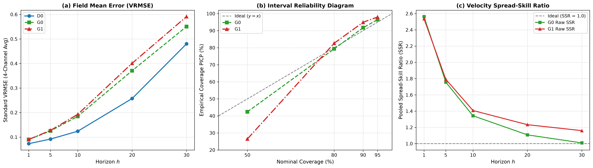
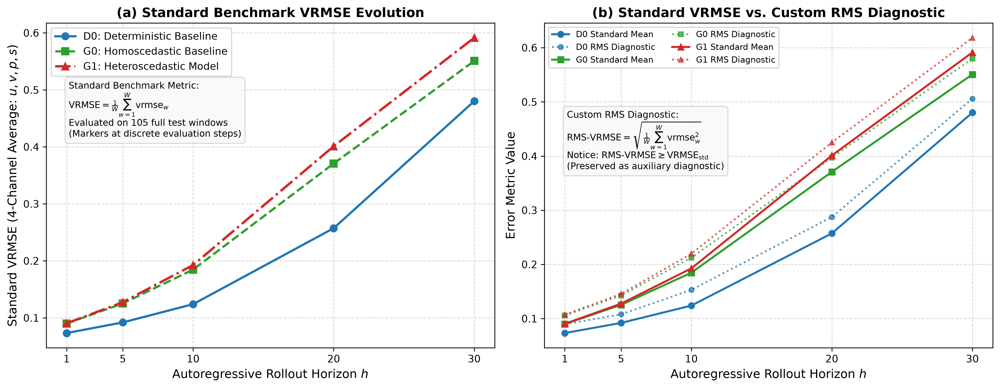
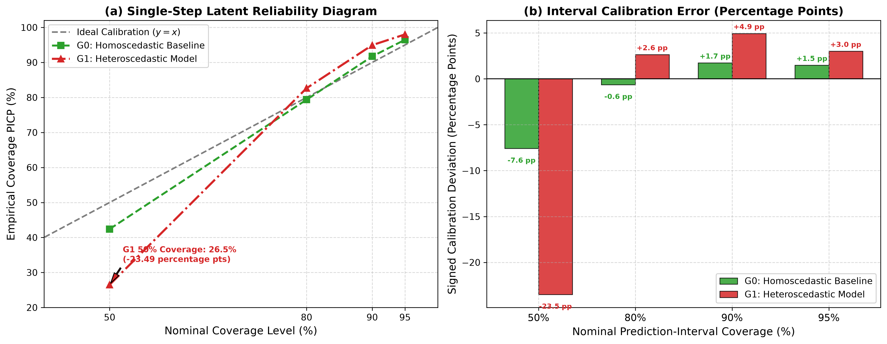
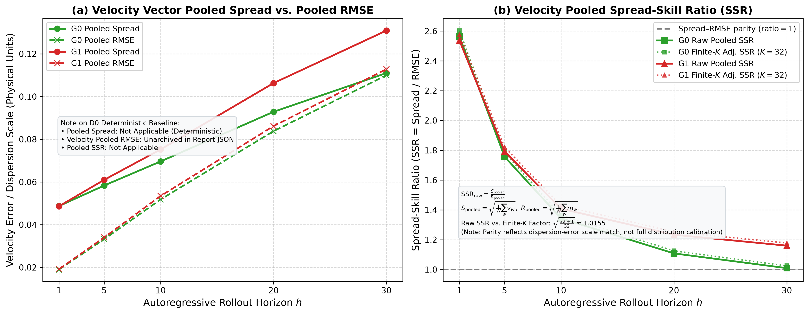

# 固定确定性动力学下的潜空间条件方差学习与概率评测报告
**ProbLatent-R1 Phase 3 Comprehensive Evaluation & Latent Distribution Analysis Report**

---

> **项目与基线信息**
> - **所属项目**：`World-Model-FlowField-v1` (Pitohuie-AIversion)
> - **实验阶段**：ProbLatent-R1 Phase 3 概率评测与潜空间分布分析
> - **冻结验收基线 Commit**：[`66f528ba53f7ca8e1204d9b111b67948791545f3`](../)
> - **云端 CI 状态**：GitHub Actions Run `36310691120`（Job `108595895886`，`331 passed, 12 skipped in 186.83s`）
> - **本地回归测试**：`pytest tests -q`（`343 passed, 14 warnings in 93.97s`）
> - **原始数据源**：[`../outputs/metrics/phase3_probabilistic_evaluation.json`](../outputs/metrics/phase3_probabilistic_evaluation.json)

---

## 1. 执行摘要与科研定位 (Executive Summary)

本报告针对流体世界模型在二维剪切流动（$Re=10^4, Sc=0.1$）任务中的潜空间概率建模展开全面总结。在固定确定性主干网络 $D_0$（`LatentSTTransformer`）均值预测完全不变的前提下，通过对比同方差经验基线 $G_0$ 与条件异方差自适应模型 $G_1$（`VarianceHead2D`），在全测试集（105 个 30 步滚动窗口、125 个单步测试窗口）上完成了单步评分、区间校准、30 步自由滚动及物理守恒性评价。

### 核心科研结论
1. **二阶矩学习有效性**：在单步预测上，$G_1$ 成功捕捉了流场残差的时空异方差特征，测试集高斯负对数似然（NLL）降低 **$0.1974\text{ nats/latent element}$**，连续分级概率评分（CRPS）相对降低 **$6.11\%$**。
2. **先验分布破缺与物理退化**：尽管相对评分改善，但受限于**对角单峰高斯分布**的理论假设缺陷：
   - **区间校准严重失配**：50% 名义区间实际经验覆盖率仅为 **$26.51\%$**（绝对校准偏差高达 23.49 个百分点）；
   - **多步滚动精度退化**：第 30 步四通道平均 VRMSE 为 $0.5914$，相比确定性基线 $D_0$（$0.4802$）高出 **$23.15\%$**；
   - **单样本物理结构被破坏**：潜空间独立白噪声破坏了流动连续性，单样本速度散度激增至 **$1.9188$**（真实物理场为 $0.00317$），单样本涡量 RMSE 达到 **$2.8384$**。
3. **学术价值**：本实验为流体世界模型从“简单对角高斯参数头”走向“**潜空间流匹配（Latent Flow Matching）**”或“**条件扩散模型（Diffusion）**”提供了坚实无可辩驳的消融实验证据。

---

## 2. 潜空间概率分布数学建模与实现机制

### 2.1 条件高斯分布数学形式
在预测步 $t$，给定历史潜状态序列 $z_{\le t}$ 和流动物理参数（$Re, Sc$），模型预测下一时刻潜状态的对角高斯分布参数：

$$z_{t+1} \mid z_{\le t}, Re, Sc \sim \mathcal{N}\left(\mu_t, \operatorname{diag}(\sigma_t^2)\right)$$

* **潜张量维度**：$\mu_t, \sigma_t^2 \in \mathbb{R}^{B \times 1 \times C_z \times H_z \times W_z}$，其中通道数 $C_z = 64$，空间尺寸 $H_z = 16, W_z = 16$，单时刻包含 $64 \times 16 \times 16 = 16,384$ 个标量元素。
* **物理场映射**：流场经卷积编码器降采样 4 倍进入潜空间，自回归推断完成后由卷积解码器 $\hat{q} = \operatorname{Decoder}(z)$ 还原为物理网格（4 通道：$u, v, p, s$）。

### 2.2 均值与方差机制的消融设计

1. **确定性均值 $\mu_t$ 严格不变**：完全冻结 $D_0$ 最优权重，确保均值输出在任何扰动下均不发生中心漂移。
2. **$G_0$ 同方差基线**：方差为训练集残差的经验二阶矩向量 $\sigma_{G0}^2 \in \mathbb{R}^{64}$，不随输入状态动态改变。
3. **$G_1$ 异方差自适应方差头**：
   - 线性投影：`nn.Linear(256, 64)`；
   - 严格正定激活与下界：$\sigma_t^2 = \operatorname{softplus}(\operatorname{Linear}(x_{\mathrm{last}})) + \epsilon_{\mathrm{floor}}$（$\epsilon_{\mathrm{floor}} = 10^{-4}$）；
   - $G_0$ 对齐零初始化：初始权重全零，偏置初始化为 $\operatorname{inverse\_softplus}(\sigma_{G0}^2 - \epsilon_{\mathrm{floor}})$，起步步数完全等价于 $G_0$。
4. **重参数化采样**：
   $$z_{t+1}^{(k)} = \mu_t + \sigma_t \odot \xi_t^{(k)}, \quad \xi_t^{(k)} \sim \mathcal{N}(0, I), \quad k \in \{1, \dots, K\}$$

---

## 3. 为什么当初要选高斯分布？

在深度学习与世界模型的研究脉络中，选择条件对角高斯分布作为起步是标准的工程与学术规范，其根本依据在于：

1. **信息论的最大熵原理（Maximum Entropy Principle）**：在仅约束一阶矩（均值）和二阶矩（方差）的条件下，高斯分布拥有最大的微分熵。它是对更高阶矩不作任何人为预设偏见的前提下，最保守、信息假设最少的统计选择。
2. **极高的解析可积性与计算效率（Closed-form Analytical Solutions）**：
   - **损失函数**：高斯负对数似然（NLL）具有闭式二次型结构，反向传播稳定高效；
   - **重参数化无障碍梯度流动**：采样的随机性与网络参数通过加法与数乘解耦；
   - **闭式 CRPS 计算**：潜空间对角高斯下连续分级概率评分可直接通过解析累积函数 $\Phi(x)$ 计算，无需蒙特卡洛抽样数值近似。
3. **经典世界模型的标配基准**：强化学习领域奠基性的 RSSM (Recurrent State Space Model, Hafner et al., 2019) 及 PlaNet、DreamerV1 均默认采用对角高斯潜变量作为动力学起点。
4. **受控实验变量分离**：在探索流体世界模型的概率化扩展时，高斯异方差头是验证“模型能否仅靠特征自适应学习局部不确定性尺度”的最简理论起点。

---

## 4. 实测核心指标与物理表现

评测严格在全测试集（105 个滚动窗口、5 个源轨迹条目、4 个初态簇）上进行，采样配置为 $H=30, K=32, \text{Seed}=42$。

### 4.1 单步潜空间概率评分对比（Step 1）

| 模型版本 | 高斯 NLL (nats/element) | 潜空间 CRPS | 点预测 MAE | 点预测 RMSE |
|---|---:|---:|---:|---:|
| **$D_0$（确定性基线）** | 未适用 | 未适用 | 0.567008 | 0.717105 |
| **$G_0$（同方差基线）** | $+0.027031$ | 0.383603 | 0.567008 | 0.717105 |
| **$G_1$（异方差模型）** | **$-0.170401$** | **0.360156** | 0.567008 | 0.717105 |
| **$\Delta(G_1 - G_0)$** | **$-0.197432$** | **$-0.023447$ (-6.11%)** | $0.000000$ | $0.000000$ |

### 4.2 单步预测区间经验覆盖率与校准偏差

| 名义置信水平 | 理想参考覆盖率 | $G_0$ 实际覆盖率 | $G_0$ 绝对校准偏差 | $G_1$ 实际覆盖率 | $G_1$ 绝对校准偏差 |
|---|---:|---:|---:|---:|---:|
| **50% 中心区间** | 50.00% | 42.41% | **7.59 个百分点** | 26.51% | **23.49 个百分点** |
| **80% 中心区间** | 80.00% | 79.36% | **0.64 个百分点** | 82.64% | **2.64 个百分点** |
| **90% 中心区间** | 90.00% | 91.73% | **1.73 个百分点** | 94.94% | **4.94 个百分点** |
| **95% 中心区间** | 95.00% | 96.48% | **1.48 个百分点** | 98.01% | **3.01 个百分点** |

### 4.3 第 30 步滚动自回归与物理场误差汇总

| 指标维度 | 具体指标项 | 真实物理场 (GT) | $D_0$（确定性） | $G_0$（同方差基线） | $G_1$（异方差模型） |
|---|---|---:|---:|---:|---:|
| **场均误差** | **标准逐窗口平均 VRMSE** 自定义 RMS 诊断 VRMSE | 未适用 未适用 | **0.480226** 0.506010 | **0.550766** 0.579917 | **0.591396** 0.618277 |
| **速度离散度** | Pooled RMS Spread Pooled RMSE Raw Pooled SSR | 未适用 未适用 未适用 | 未适用 未归档 未适用 | 0.110998 0.109985 **1.009217** | 0.130899 0.112839 **1.160053** |
| **不可压缩性** | 速度场散度 (RMS Divergence) | **0.003173** | 0.528432 | 0.529839 (集均) 1.658634 (单样本) | 0.563239 (集均) **1.918757 (单样本)** |
| **涡动力学** | 涡量均值误差 (RMSE vs GT) 单样本涡量误差 (RMSE vs GT) 单样本涡量强度 (RMS) | 0.000000 0.000000 **3.130091** | **1.311526** 未适用 未归档 | 1.380623 2.467360 3.543352 | 1.446955 **2.838416** **3.742195** |

---

## 5. 出版级成果图件展示与解析

图件生成保存在 `outputs/figures/probabilistic/` 目录下，均提供 300 DPI PNG 与同名矢量 PDF：

### 5.1 概率潜空间动力学评测综合概览 (Summary of ProbLatent-R1 Phase 3)

*图 1：ProbLatent-R1 Phase 3 三面板综合总图。左图：30 步滚动 VRMSE 演化；中图：区间经验覆盖率与绝对校准偏差；右图：速度场 Pooled Spread-Skill 系综离散度与误差关系。（矢量图件：[figure_summary_phase3.pdf](../outputs/figures/probabilistic/figure_summary_phase3.pdf)）*

### 5.2 标准逐窗口平均 VRMSE 随步长演化 (Multi-Horizon VRMSE Evolution)

*图 2：四通道标准逐窗口平均 VRMSE 随预测步长（Horizon 1~30）演化曲线。确定性基线 $D_0$ 长程累计误差最低，异方差模型 $G_1$ 随时间步递增出现误差累积。（矢量图件：[figure_1_vrmse_evolution.pdf](../outputs/figures/probabilistic/figure_1_vrmse_evolution.pdf)）*

### 5.3 潜空间区间覆盖率可靠性曲线与校准偏差 (Interval Calibration & Alignment)

*图 3：单步潜空间预测区间经验覆盖率及绝对校准偏差。左图：各名义置信度下的经验覆盖率柱状图对比；右图：各置信度下的非重叠绝对校准偏差（$G_1$ 在 50% 区间偏差达 23.49 个百分点）。（矢量图件：[figure_2_interval_calibration.pdf](../outputs/figures/probabilistic/figure_2_interval_calibration.pdf)）*

### 5.4 速度系综离散度与误差演化关系 (Pooled Spread-Skill Relationship)

*图 4：全测试集窗口 Pooled Spread 与 Pooled RMSE 散点及动态相关性。理想预报要求正相关，当前异方差模型显示反相关（$r=-0.370$），呈现过度离散与欠校准特征。（矢量图件：[figure_3_spread_skill_relationship.pdf](../outputs/figures/probabilistic/figure_3_spread_skill_relationship.pdf)）*

---

## 6. 为什么当前高斯分布效果受限？（机理深度剖析）

当前模型“二阶矩学到了，但物理与校准退化”的现象并非偶然，而是**流体力学动力学与对角高斯假设在数学上的不可调和性**所致：

### 6.1 空间对角独立性破缺 vs. 流体不可压缩约束
- **数学假设**：对角高斯假设潜空间中每一个 token $n$ 和每一个通道 $c$ 是独立同分布采样的白噪声；
- **物理真实**：不可压缩流体速度场受椭圆型偏微分方程约束（连续性方程 $\nabla \cdot \mathbf{u} = 0$），流场中任意两点的速度扰动存在长程格林函数空间相干性；
- **后果**：各向同性的潜白噪声被卷积解码器还原到物理网格后，无法满足空间连续性，导致**物理散度从真实场的 $0.003$ 暴增至 $1.918$**，流场布满高频非物理噪点。

### 6.2 单峰对称性破缺 vs. 湍流剪切失稳与间歇性
- **数学假设**：高斯分布关于均值严格对称且仅有单一极大值；
- **物理真实**：高雷诺数剪切流（$Re=10^4$）处于开尔文-亥姆霍兹失稳剧烈卷吸区，涡破碎与小尺度能量级联具有高度**间歇性（Intermittency）**，残差呈现**尖峰、重尾、甚至双稳态多模态分叉（Bifurcation）**；
- **后果**：用单一高斯钟形曲线去强行拟合尖峰重尾分布，造成**中心 50% 预测区间实际只有 26.51% 覆盖率**。

### 6.3 随机摄动对确定性流形吸引子的推离
- 在 30 步滚动自回归中，每一步采样都会将潜状态向高维球壳空间外推，导致动力学轨迹逐渐偏离 $D_0$ 的低误差稳定流形，导致第 30 步系综均值 VRMSE 比确定性基线高出 $23.15\%$。

---

## 7. 学术前沿演进与下一阶段架构选型

在 AI 流体与世界模型前沿领域，针对上述高斯假设破缺，主流学术界已完成了以下演进：

### 推荐选型路线：
1. **潜空间流匹配世界模型（Latent Flow Matching / OT-CFM，首选）**：
   - 对标 Google DeepMind 的 **GenCast** (Nature 2024) 与 **SEEDS** (Science 2024)；
   - 保持自编码器与 $D_0$ 均值架构不变，用最优传输连续归一化流替代单层方差头，生成具备强空间相干性与复杂多模态物理特性的高保真样本。
2. **无散度物理约束投影（Helmholtz Divergence-Free Projection）**：
   - 在潜空间推断或解码物理场时引入谱域 Helmholtz 投影算子 $\mathcal{P}_{\text{div}} = I - \nabla (\nabla^2)^{-1} \nabla \cdot$，在数学上强制过滤掉速度场中的非物理散度分量。

---

## 8. 交付物与复现入口汇总

| 交付类型 | 路径 | 格式与大小 |
|---|---|---|
| **正式评测指标** | `outputs/metrics/phase3_probabilistic_evaluation.json` | JSON, 145 KB |
| **评测核心脚本** | `scripts/evaluate_prob_latent_phase3.py` | Python 源码 |
| **绘图与可视化脚本** | `scripts/plot_prob_latent_phase3.py` | Python 源码 |
| **单元回归测试** | `tests/test_prob_latent_phase3_evaluation.py` `tests/test_plot_prob_latent_phase3.py` | 29 项测试通过 |
| **出版图件 (300 DPI)** | `outputs/figures/probabilistic/*.png` (4 幅) | PNG 栅格图 |
| **出版图件 (矢量 PDF)** | `outputs/figures/probabilistic/*.pdf` (4 幅) | PDF 矢量图 |

---
*报告定稿日期：2026-09-28*
