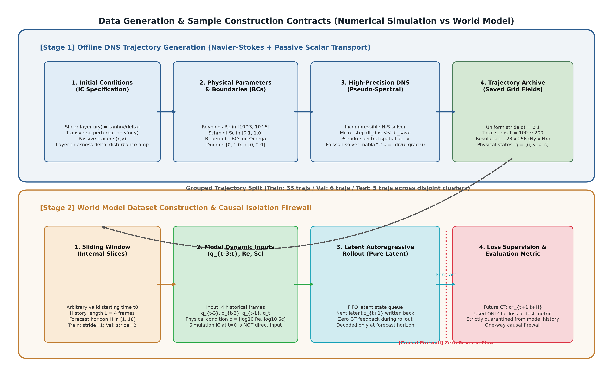

# 02 实验场景与数据集构建 (Experimental Setting & Data Construction)

在连续介质流体系统的机器学习建模中，混淆“数值求解器的连续推进过程”与“离线数据切窗与模型样本构建过程”是导致数据泄漏与评测偏差的常见根源。本节明确厘清物理控制方程、仿真生成管线、数据切窗协议以及严格的初态隔离机制。

---

## 2.1 物理场景与控制方程

本文所研究的物理环境遵循二维不可压缩纳维-斯托克斯（Navier-Stokes）方程与被动标量输运方程耦合系统。在无量纲形式下，流场满足如下偏微分方程组：

$$\nabla \cdot \mathbf{u} = 0 \quad (\text{质量守恒 / 不可压缩条件})$$

$$\frac{\partial \mathbf{u}}{\partial t} + (\mathbf{u} \cdot \nabla)\mathbf{u} = -\nabla p + \frac{1}{Re} \nabla^2 \mathbf{u} \quad (\text{动量守恒方程})$$

$$\frac{\partial s}{\partial t} + (\mathbf{u} \cdot \nabla)s = \frac{1}{Re \cdot Sc} \nabla^2 s \quad (\text{被动标量输运方程})$$

其中：
- 速度矢量场 $\mathbf{u}(x, y, t) = (u(x, y, t), v(x, y, t))$；
- 动力学压力标量场 $p(x, y, t)$ 由连续性条件通过泊松方程 $\nabla^2 p = -\nabla \cdot [(\mathbf{u} \cdot \nabla)\mathbf{u}]$ 隐式决定，在周期边界下具有常数自由度（Gauge Freedom）；
- 被动标量浓度场 $s(x, y, t) \in [0, 1]$ 纯粹受流场平流输运与分子扩散控制，不向动量方程施加反作用力（One-way coupling）；
- $Re = \frac{U_{\text{char}} L_{\text{char}}}{\nu}$ 为流体雷诺数，其中 $\nu$ 为运动粘性系数；
- $Sc = \frac{\nu}{D}$ 为施密特数，其中 $D$ 为标量分子扩散系数。

#### 表 1：物理场景与数据离散规格表
| 物理属性 / 参数项 | 设定值与数学描述 | 备注与说明 |
| :--- | :--- | :--- |
| **计算物理空间域 $\Omega$** | 矩形域 $[0, L_x] \times [0, L_y] = [0, 1.0] \times [0, 2.0]$ | 流向长 $L_x = 1.0$，法向长 $L_y = 2.0$ |
| **空间离散网格** | $N_x \times N_y = 128 \times 256$ | 各向同性空间步长 $\Delta x = 1.0 / 128 = 1/128, \Delta y = 2.0 / 256 = 1/128$ |
| **边界条件 (Boundary Conditions)** | 双向完全周期边界（Bi-periodic BC） | 在 $x$ 与 $y$ 方向均满足拓扑环状周期条件 |
| **物理状态变量通道** | 4 通道：$[u, v, p, s]$ | 包含流向速度、法向速度、动力学压力与被动标量 |
| **雷诺数范围 $Re$** | 规范参数范围为 $Re \in [10^3, 10^5]$；**当前评测基准统一固定为单一 $Re = 10000$** | 动力粘性系数 $\nu = 1/Re = 10^{-4}$。跨雷诺数留出泛化受限于目前物理数据归档，在清单中明确标注为待扩展项 |
| **施密特数范围 $Sc$** | 规范范围 $Sc \in [0.1, 1.0]$。训练与验证集包含 $Sc=0.1$ 与 $Sc=1.0$，当前测试分区固定为 $Sc=0.1$ | 标量分子扩散系数 $D = 1/(Re \cdot Sc) = 10^{-3}$（当 $Sc=0.1$ 时） |
| **保存帧时间采样间隔 $\Delta t$** | 外部时间坐标采样间隔 $\Delta t = 0.1$ | 世界模型输入与自回归推进的基本物理时间离散单元 |
| **求解器内部微推进设置** | 存储帧间隔为无量纲时间 0.1。高精度拟谱求解器内部的时间步长（CFL 约束自适应微步）属于离线生成参数，**本论文不将未经核实的内部微步长列为确定性超参**。 | 外部存储帧按 $\Delta t = 0.1$ 均匀抽取，模型输入与预测均基于存储帧序列推进 |

---

## 2.2 数值仿真轨迹的生成机制

基准数据源自大规模流体物理基准 *The Well* 中的 `shear_flow` 数据集。其数值仿真的离线生成流程如下：

$$\text{初始剪切层剖面与横向随机正弦扰动} \longrightarrow \text{高精度拟谱求解器时间推进} \longrightarrow \text{泊松压力投影} \longrightarrow \text{按 } \Delta t = 0.1 \text{ 离散持久化}$$

1. **初态构造**：在双周期矩形域中，初始水平速度剖面采用双剪切层双曲正切函数（Hyperbolic Tangent）：
   $$u(x, y, 0) = \begin{cases} U_0 \tanh\left(\frac{y - y_1}{\delta}\right), & y \le 1.0 \\ U_0 \tanh\left(\frac{y_2 - y}{\delta}\right), & y > 1.0 \end{cases}$$
   其中 $y_1, y_2$ 为剪切层中心线，$\delta$ 为剪切层初始厚度。在竖直速度上叠加微弱的周期正弦谱随机微扰（Perturbation），诱发 Kelvin-Helmholtz 不稳定性；
2. **拟谱求解与投影**：数值求解器采用拟谱法（Pseudo-spectral Method）计算空间导数，通过压力泊松方程消除速度场的散度分量，保证离散连续性条件在数值精度内严格成立；
3. **轨迹存储**：系统演化 200 个存储时间步（总无量纲物理时间 $T = 20.0$），每隔 $\Delta t = 0.1$ 存储一帧包含 $[u, v, p, s]$ 的全场浮点阵列。

---

## 2.3 历史观测、仿真初态与未来真值的因果关系

为防止概念混淆，下表形式化定义各物理量在数值仿真系统与世界模型系统中的根本区别：

#### 表 2：仿真生成信息与世界模型输入输出因果关系表
| 物理信息项 | 在数值仿真系统中的作用 | 在流场世界模型中的实际作用与约束 |
| :--- | :--- | :--- |
| **仿真时刻零的初态场 $q(t=0)$** | 决定整条数值轨迹唯一的初始柯西条件 | **仅当滑动窗口刚好滑到轨迹起始端时才作为历史观测输入；其余时刻模型无需也不接触该初态** |
| **剪切层厚度与扰动谱幅值** | 求解器离线生成不同轨迹的隐式生成参数 | 属于求解器内部生成参数，**当前模型架构中不作为额外特征显式输入** |
| **连续四帧历史物理场 $q_{t-3:t}$** | 完整时间序列中的局部连续观测片段 | **世界模型的唯一动态物理输入**（用于提取局部动力学流形并执行前向外推） |
| **物理参数 $Re$ 与 $Sc$** | 决定连续偏微分方程中的粘性与扩散系数 | **作为全局环境条件输入**，通过自适应层归一化（AdaLN）调制潜在时空特征 |
| **双周期边界条件** | 规定物理域的空间微分拓扑 | 体现在模型的周期卷积填充（`circular padding`）与傅里叶谱算子中，固定不可变 |
| **外部时间间隔 $\Delta t = 0.1$** | 离散存储的采样时间尺度 | 决定状态转移算子的推进时间尺度；模型在离散步长意义下学习一步推进映射 |
| **未来真实状态 $q^*_{t+1:t+H}$** | 数值求解器计算得到的未来真实流动场 | **仅在训练阶段用于计算损失，在测试阶段用于计算误差；自由滚动推演时严禁回灌** |

> **关键机制说明（滑动窗口与初态无关性）**：
> 世界模型的输入窗口是在连续数值轨迹上滑动构建的。例如，当滑动窗口选取物理时刻 $t = 5.0, 5.1, 5.2, 5.3$ 作为 4 帧历史输入时，模型预测的目标为 $t = 5.4$（单步）或 $t = 5.4 \sim 8.3$（30 步滚动）。在此过程中，模型推演的“起始时刻”完全脱离了仿真的 $t=0$ 初始条件。在自由滚动中，第二步预测以模型自身生成的 $\widehat{q}_{5.4}$ 更新潜历史队列，绝不接触真实场 $q^*_{5.4}$。

*现有图 1 读图说明*：展示了剪切层流动的典型时空非线性演化。初始平直的流向剪切层（$u$）在微扰激发下卷起失稳，法向对流速度（$v$）迅速激发，压力场（$p$）在失稳涡核中心形成显著的局部低压凹陷，被动示踪标量（$s$）被强对流卷吸拉伸形成微细条带。此为 DNS 真实基准轨迹，展现了多尺度旋涡演化的高维特征。

---

## 2.4 数据规模、初态划分与防泄漏协议 (Zero-IC-Leakage)

在流体动力学机器学习中，如果在同一初始扰动演化出的轨迹内部切分训练集与测试集（例如将前半段用于训练，后半段用于测试），会导致严重的“初态记忆泄漏”（IC-Leakage），使模型退化为记忆轨迹而非学习流动泛化动力学。

本研究在数据划分上实施严密的 **初态聚类隔离协议（Zero-IC-Leakage Protocol）**：
1. **数据划分哈希指纹**：全体数据集的切分完全受控于 `outputs/splits/grouped_split.json`，其全局唯一的 SHA-256 校验和为：
   $$\text{split\_hash} = \texttt{41fbe6ebe7edd460b4353fd6cf20ad064f1222fdcb4558b04ff1a50be390b93d}$$
2. **目录路径与真实分区解耦声明**：磁盘物理路径名（如 `data/test/shear_flow_Reynolds_1e4_Schmidt_1e-1.hdf5`）**绝不代表**其内部所有轨迹均属于测试集。根据初态聚类算法（Cluster ID）：
   - `traj_idx=0` 被分配至 Cluster 0，属于**训练集**；
   - `traj_idx=1` 被分配至 Cluster 1，属于**测试集**；
   - `traj_idx=2` 被分配至 Cluster 2，属于**训练集**；
   - `traj_idx=3` 被分配至 Cluster 3，属于**验证集**。
   所有模型评估与检查点验证必须严格绑定该 JSON 划分指纹，彻底杜绝凭文件名推断样本身份导致的数据污染。

#### 表 3：实际数据集划分、切窗规格与归一化管理表
| 数据分区 (Split) | 源轨迹条目数 | 独立初态簇数 (Clusters) | 历史窗口 $L$ | 训练预测跨度 $H$ | 内部切窗步长 (Stride) | 归一化统计量使用规则 |
| :--- | :---: | :---: | :---: | :---: | :---: | :--- |
| **训练集 (Train)** | 33 | 27 | 4 帧 | 1 ~ 16 步 | Stride = 1 | **唯一允许拟合通道均值与标准差的分区** |
| **验证集 (Val)** | 6 | 4 | 4 帧 | 1 ~ 16 步 | Stride = 2 | 严格冻结使用训练集统计量，禁止重新拟合 |
| **测试集 (Test)** | 5 | 4 | 4 帧 | 30 步滚动 | Stride = 1 | 严格冻结使用训练集统计量，确保测试分布无污染 |

> **关键概念澄清：源轨迹条目与切窗评估样本容量 ($N_{\text{test}}$)**：
> 测试分区包含 5 个源轨迹条目（涵盖 4 个严格独立的初态簇）。在执行空间表征重构及自回归滚动评测时，数据加载器沿各测试轨迹的时间轴以步长滑动切片，共构建出 $N_{\text{test}} = 45$ 个独立的时序评估窗口切片（Temporal Window Slices）。后续所有实验结果表与分析中报告的 $N_{\text{test}} = 45$，严格指代这 45 个切窗测试样本，绝不能混淆为 45 条独立源轨迹。

**数据归一化方案**：在训练集全域计算 4 个物理通道的全局均值 $\mu_c$ 与标准差 $\sigma_c$（$c \in \{u, v, p, s\}$），保存于 `outputs/normalization/stats_grouped.pt`。模型输入统一执行通道标准化：
$$\widetilde{q}_{t, c} = \frac{q_{t, c} - \mu_c}{\sigma_c}$$
解码器输出在进入物理损失计算或评测指标统计前，通过逆变换反归一化回真实物理量空间：
$$\widehat{q}_{t, c} = \widehat{\widetilde{q}}_{t, c} \cdot \sigma_c + \mu_c$$
确保所有物理微分算子（散度、涡量、能谱）均在未缩放的真实物理量级下计算。
