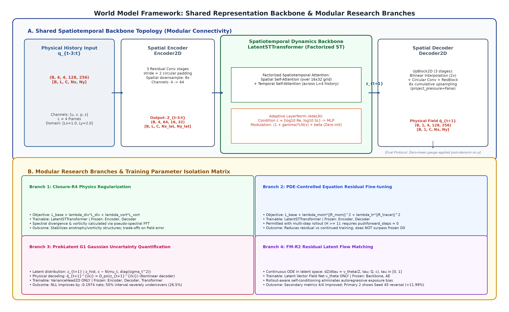
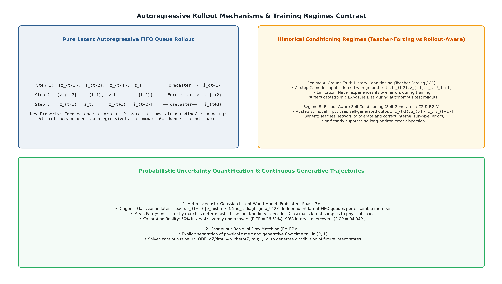

# 03 模型架构与预测方法 (Model Architecture & Methodology)

本节系统阐述面向二维剪切流的潜空间世界模型（Latent World Model）架构。模型由共享的空间表征基础主干（空间自编码器与时空潜转移网络）及可选的扩展实验分支（连续方程残差微调、高斯异方差概率头、残差连续流匹配）构成。

---

## 3.1 整体架构与张量流转规范

流场世界模型的核心设计范式为“**空间降维编码—紧凑潜流形动力学推演—高保真解耦还原**”。数据在网络前向传递过程中的严格张量形状流转形式化定义如下：

$$\underbrace{q_{t-L+1:t} \in \mathbb{R}^{B \times L \times 4 \times 128 \times 256}}_{\text{历史连续物理场输入}} \xrightarrow[\text{Encoder2D (Frozen)}]{64\times \text{ 周期卷积下采样}} \underbrace{Z_{t-L+1:t} \in \mathbb{R}^{B \times L \times 64 \times 16 \times 32}}_{\text{紧凑时空潜状态表征序列}}$$

$$\underbrace{Z_{t-L+1:t} \in \mathbb{R}^{B \times L \times 64 \times 16 \times 32}}_{\text{输入时空潜转移网络}} \xrightarrow[\text{LatentSTTransformer (Trainable)}]{\text{AdaLN 条件调制}} \underbrace{\widehat{Z}_{t+1} \in \mathbb{R}^{B \times 1 \times 64 \times 16 \times 32}}_{\text{单步下一时刻潜状态预测}}$$

$$\underbrace{\widehat{Z}_{t+1} \in \mathbb{R}^{B \times 1 \times 64 \times 16 \times 32}}_{\text{潜状态输入解码器}} \xrightarrow[\text{Decoder2D (Frozen)}]{8\times \text{ 双线性插值 + 周期卷积}} \underbrace{\widehat{q}_{t+1} \in \mathbb{R}^{B \times 1 \times 4 \times 128 \times 256}}_{\text{物理空间真实流场重构}}$$

#### 表 4：子模块结构规格与张量变换表
| 子模块名称 | 输入张量尺寸 | 输出张量尺寸 | 核心操作与拓扑层级 | 物理与结构特性 |
| :--- | :--- | :--- | :--- | :--- |
| **空间编码器 (Encoder2D)** | $(B, 4, 128, 256)$ | $(B, 64, 16, 32)$ | 3 级步幅为 2 的周期残差卷积块（ResNet Block），通道由 4 逐级升至 64 | 双周期填充，空间面积压缩 64 倍，保留二维相对网格布局 |
| **物理条件嵌入 (Embedding)** | $(B, 2)$ | $(B, 128)$ | 2 层 MLP，输入对数物理量 $[\log_{10} Re, \log_{10} Sc]$ | 零初始化自适应投影，避免冷启动扰动 |
| **时空主干 (LatentSTTransformer)** | $(B, L, 64, 16, 32)$ | $(B, 1, 64, 16, 32)$ | 6 层空间—时间分解多头注意力，通道隐藏维 $D=256$，嵌入 AdaLN 调制 | 空间/时间分离计算，规避三次幂展开，维持因果性 |
| **空间解码器 (Decoder2D)** | $(B, 64, 16, 32)$ | $(B, 4, 128, 256)$ | 3 级 UpBlock2D（$2\times$ 双线性插值 + 周期残差卷积），通道降回 4 | 各向同性累计放大 8 倍；`project_pressure=False` |

---

## 3.2 空间编码、分解注意力与物理条件调制

### 1. 保拓扑双周期空间卷积自编码器
流体动力学具有双向严格的周期性边界条件（Bi-periodic BC）。常规的零填充（Zero Padding）或反射填充（Reflect Padding）会在物理域边界破坏通量守恒并产生虚假的边界层激波。为此，空间编码器与解码器的全部卷积层均显式采用环状周期填充（`padding_mode='circular'`）。
- 编码器通过 3 级步幅为 2 的周期残差块，将原始物理网格 $(128, 256)$ 降采样至潜网格 $(16, 32)$；
- 潜表示保留了二维显式网格结构，使得特征图中的相邻潜节点直接对应物理空间的局部邻域，维持了流场内在的局部平移等变性。

### 2. 空间—时间分解多头自注意力机制 (Factorized Spatiotemporal Attention)
若将三维时空潜张量 $(L, H_z, W_z) = (4, 16, 32)$ 直接展平为序列，长度为 $4 \times 16 \times 32 = 2048$。在更高分辨率或多步展开时，其全局自注意力的显存与计算复杂度将面临急剧增长。
本文采用空间与时间分解注意力机制：
- **空间自注意力 (Spatial Attention)**：在每个离散时间帧内部，固定时步轴，潜特征图中的 $16 \times 32 = 512$ 个空间节点之间计算多头自注意力，捕捉同一时刻远距离涡旋之间的瞬态感应（Induction）；
- **时间自注意力 (Temporal Attention)**：固定空间网格位置，在历史 $L$ 帧时间序列维度上计算多头自注意力，捕捉固定空间位置的动态流速演化；
- 注意力计算不沿水平和竖直空间轴进行人为的人工拆分，完整保留二维流向与展向的非对称相互作用。

### 3. 零初始化物理条件调制 (Zero-Initialized AdaLN)
雷诺数 $Re$ 与施密特数 $Sc$ 跨越数个数量级（$10^3 \sim 10^5$），决定了连续介质方程中的扩散耗散尺度。为了将标量物理参数无缝注入时空 Transformer，本文引入基于自适应层归一化（Adaptive Layer Normalization, AdaLN）的调制机制：
1. 首先将物理参数转换为对数标量：$c = [\log_{10} Re, \log_{10} Sc] \in \mathbb{R}^2$；
2. 通过两层全连接网络将 $c$ 映射至条件向量 $e(c) \in \mathbb{R}^{128}$；
3. 在 Transformer 模块的各归一化层后，通过线性映射生成缩放系数 $\gamma$ 与偏置系数 $\beta$：
   $$\operatorname{AdaLN}(x, c) = (1 + \gamma(c)) \odot \operatorname{LayerNorm}(x) + \beta(c)$$
4. **零初始化保障**：生成 $\gamma$ 与 $\beta$ 的线性输出层权重与偏置被显式初始化为零。在训练初始阶段，$\gamma \equiv 0, \beta \equiv 0$，$\operatorname{AdaLN}(x, c) \equiv \operatorname{LayerNorm}(x)$，彻底消除了由于条件参数突变引入的高幅值随机扰动，确保了网络冷启动阶段的数值平稳性。

### 4. 压力规范与空间后处理约束
不可压缩流体的动量方程中仅包含压力梯度项 $\nabla p$，这意味着压力场在数学上存在任意常数相差自由度（Gauge Invariance）：
$$p(x, y, t) \sim p(x, y, t) + C(t)$$
为确保实验一致性与学术规范，本文在代码与架构层面对压力处理做出严谨界定：
- 在空间解码器前向推理与动力学训练中，实例参数明确设置为 `project_pressure=False`，解码器内部不执行易引发梯度不稳定的硬投影；
- **压力规范作为评测协议后处理（Post-processing Protocol）严格执行**：在模型输出张量完成反归一化、还原为真实物理量之后，分别对预测压力场与真实压力场扣除其瞬时空间全局均值：
  $$p_{\text{gauge}}(x, y) = p(x, y) - \frac{1}{L_x L_y} \iint_{\Omega} p(x, y) \, dx dy$$
  从而严格消除自由常数漂移对均方根误差（RMSE）与空间梯度的伪干扰。

---

## 3.3 潜空间 FIFO 纯潜状态自由滚动自回归推演

在长时间推演中，流场世界模型摆脱了传统神经算子每步反复进行“物理空间 $\to$ 潜空间 $\to$ 物理空间”往返重构的巨大计算开销，采用**纯潜空间先进先出（FIFO）队列更新机制**：

### 纯潜自回归推进算法 (Algorithm 1)
1. **历史初始化**：在推演起点 $t_0$，将已知连续 4 帧物理观测 $q_{t_0-3:t_0}$ 输入冻结的空间编码器 $\mathcal{E}$，一次性生成初始潜状态历史序列：
   $$\mathcal{H}_0 = [Z_{t_0-3}, Z_{t_0-2}, Z_{t_0-1}, Z_{t_0}] \in \mathbb{R}^{4 \times 64 \times 16 \times 32}$$
2. **循环外推推进**：对于未来离散预测步长 $k = 1, 2, \dots, H_{\text{rollout}}$：
   - 潜转移网络以当前潜历史队列 $\mathcal{H}_{k-1}$ 与物理条件 $c$ 为输入，预测下一时刻潜状态：
     $$\widehat{Z}_{t_0+k} = \mathcal{M}_\theta(\mathcal{H}_{k-1}, c)$$
   - 更新潜历史队列（FIFO 弹出最旧帧，尾部压入预测帧）：
     $$\mathcal{H}_k = [Z_{t_0-3+k}, \dots, \widehat{Z}_{t_0+k}]$$
3. **终端一次性解码**：在完成指定步长（如 $H=30$）的纯潜推演后，将预测的潜状态序列 $[\widehat{Z}_{t_0+1}, \dots, \widehat{Z}_{t_0+H}]$ 一次性输入冻结的空间解码器 $\mathcal{D}$，还原为真实时空流场序列 $\widehat{q}_{t_0+1:t_0+H}$。

> **自由滚动因果防火墙原则**：
> 自由滚动推演期间，严格禁止任何外部真实物理场 $q^*$ 回灌潜历史队列；除初始 4 帧外，后续每一步推演的输入完全由模型自身此前的输出构成。

---

## 3.4 监督损失函数、物理约束与训练隔离矩阵

### 1. 确定性基础损失与谱物理监督 (Closure-R4)
为使预测场既满足数值逼真度，又符合流体力学基本守恒定律，确定性主干的联合优化目标由基础场值损失与频域谱物理正则项构成：

$$\mathcal{L}_{\text{total}} = \sum_{h=1}^H w_h \mathcal{L}_{\mathrm{field}, h} + \lambda_{\mathrm{div}} \mathcal{L}_{\mathrm{div}} + \lambda_\omega \mathcal{L}_\omega$$

### 1. 确定性基础损失与谱物理监督 (Closure-R4)
为使预测场既满足数值逼真度，又符合流体力学基本守恒定律，确定性主干的联合优化目标由基础场值损失与频域谱物理正则项构成：

$$\mathcal{L}_{\text{total}} = \sum_{h=1}^H w_h \mathcal{L}_{\mathrm{field}, h} + \lambda_{\mathrm{div}} \mathcal{L}_{\mathrm{div}} + \lambda_\omega \mathcal{L}_\omega$$

其中：
- **基础场值重构损失**：采用均方误差（Mean Squared Error, MSE 范数），遍历所有物理通道：
  $$\mathcal{L}_{\mathrm{field}, h} = \frac{1}{4} \sum_{c \in \{u, v, p, s\}} \frac{1}{N_x N_y} \sum_{i, j} \left( \widehat{q}_{t+h, c}(i, j) - q^*_{t+h, c}(i, j) \right)^2$$
- **傅里叶谱不可压缩散度损失 ($\mathcal{L}_{\mathrm{div}}$)**：
  流体不可压缩性要求速度场在物理空间散度为零。基于二维正交离散傅里叶变换（2D FFT），谱空间散度算子具有精确的解析频域表示：
  $$\mathcal{L}_{\mathrm{div}} = \left\| \nabla \cdot \widehat{\mathbf{u}} \right\|_2^2 = \left\| \mathcal{F}^{-1}\left( i k_x \widehat{U}(k_x, k_y) + i k_y \widehat{V}(k_x, k_y) \right) \right\|_2^2$$
  其中 $k_x = \frac{2\pi m}{L_x}, k_y = \frac{2\pi n}{L_y}$ 为离散波数，$i = \sqrt{-1}$。该算子无截断差分误差，直接惩罚产生流体膨胀/压缩的虚假波动。
- **傅里叶谱涡量损失 ($\mathcal{L}_\omega$)**：
  二维剪切流的旋转失稳演化核心体现在标量涡量场 $\omega = \frac{\partial v}{\partial x} - \frac{\partial u}{\partial y}$。同样利用谱导数构造高精度涡量监督：
  $$\mathcal{L}_\omega = \left\| \widehat{\omega} - \omega^* \right\|_2^2 = \left\| \mathcal{F}^{-1}\left( i k_x \widehat{V} - i k_y \widehat{U} \right) - \omega^* \right\|_2^2$$
  强力约束剪切失稳界面的卷吸几何与微细涡旋尺度。

### 2. 连续方程残差（PDE-Controlled）微调机制
在方程控制微调分支中，模型基于相邻状态区间 $[q_n, q_{n+1}]$ 计算 Crank-Nicolson / 梯形时间离散残差。设动量与示踪物空间微分算子分别为 $\mathcal{A}_{\mathbf{u}}(q) = (\mathbf{u} \cdot \nabla)\mathbf{u} + \nabla p - \frac{1}{Re}\nabla^2\mathbf{u}$ 与 $\mathcal{A}_s(q) = (\mathbf{u} \cdot \nabla)s - \frac{1}{Re \cdot Sc}\nabla^2 s$，残差定义为两端点算子的对称平均：
$$\mathcal{R}_{\text{mom}, n+1/2} = \frac{\widehat{\mathbf{u}}_{n+1} - \mathbf{u}_n}{\Delta t} + \frac{1}{2}\left[\mathcal{A}_{\mathbf{u}}(\widehat{q}_{n+1}) + \mathcal{A}_{\mathbf{u}}(q_n)\right]$$
$$\mathcal{R}_{\text{tracer}, n+1/2} = \frac{\widehat{s}_{n+1} - s_n}{\Delta t} + \frac{1}{2}\left[\mathcal{A}_s(\widehat{q}_{n+1}) + \mathcal{A}_s(q_n)\right]$$
$$\mathcal{L}_{\text{PDE}} = \lambda_{\text{mom}}\left\| \mathcal{R}_{\text{mom}} \right\|_2^2 + \lambda_{\text{tracer}}\left\| \mathcal{R}_{\text{tracer}} \right\|_2^2$$

> **代码约束与时间差分设置澄清**：
> 方程残差监督可以用于长程预测任务（例如项目中的 $H=12$ 受控微调实验）。但在当前代码实现中，**明确断言 `pushforward_steps = 0`，严禁与非零推前预热同时启用**。这一工程与算法约束的根源在于：若启用非零推前步数，预测时间的起点将脱离历史观测边界 $t_0$，导致时间离散差分的分母 $\Delta t$ 与空间平流基准场产生错位。

### 3. 多阶段训练与参数隔离矩阵
为保证各对比实验严密可溯，不同训练阶段与实验分支的参数更新范围受到严格物理隔离：

#### 表 5：训练阶段、可训练参数、损失组成与冻结矩阵
| 训练阶段 / 实验分支代号 | 可训练参数模块 (Trainable) | 严格冻结模块 (Frozen) | 优化目标与权重设置 | 训练周期与超参 |
| :--- | :--- | :--- | :--- | :--- |
| **阶段 1：空间自编码器** | Encoder2D, Decoder2D | 无 (端到端空间表征优化) | $\mathcal{L}_{\mathrm{field}} + 0.1 \mathcal{L}_\omega + \text{Gauge}$ | 50 Epochs, Batch=16, AdamW, $\text{lr}=10^{-3}$ |
| **阶段 2：单步基线 (E0)** | LatentSTTransformer | Encoder2D, Decoder2D 严格冻结 | 仅单步场值 MSE 损失 ($H=1$) | 40 Epochs, Batch=8, AdamW, $\text{lr}=5 \times 10^{-4}$ |
| **阶段 2：多步基线 (E1)** | LatentSTTransformer | Encoder2D, Decoder2D 严格冻结 | 2 步自回归场 MSE 损失 ($H=2$) | 40 Epochs, Batch=8, AdamW, $\text{lr}=5 \times 10^{-4}$ |
| **阶段 2：全物理约束 (E4)**| LatentSTTransformer | Encoder2D, Decoder2D 严格冻结 | $\mathcal{L}_{\mathrm{field}} + 0.01\mathcal{L}_{\mathrm{div}} + 0.05\mathcal{L}_\omega$ | 40 Epochs, Batch=8, AdamW, $\text{lr}=5 \times 10^{-4}$ |
| **阶段 3：PDE 受控微调** | LatentSTTransformer | Encoder2D, Decoder2D 严格冻结 | $\mathcal{L}_{\mathrm{base}} + \lambda_{\text{mom}}\mathcal{L}_{\text{mom}} + \lambda_{\text{tr}}\mathcal{L}_{\text{tr}}$ ($H=12, \text{pushforward}=0$) | 50 Steps, Batch=8, 恒定学习率 $5 \times 10^{-5}$ (基于父模型 D0) |
| **阶段 4：概率方差头 (G1)** | **VarianceHead2D 独占更新** | **确定性主干网络及编解码器全冻结** | 潜空间高斯负对数似然 (Latent NLL) | 30 Epochs, Batch=8, 预测局部方差 $\sigma_z^2$ |
| **阶段 5：基础残差流匹配 (FM)** | **潜速度场网络 $v_\theta$ 独占更新** | **确定性主干网络及编解码器全冻结** | 流匹配速度场平方误差回归损失 $\mathcal{L}_{\text{FM}}$ | 40 Epochs, Batch=4, 预训练连续潜速度场 |
| **阶段 5：自生成历史微调 (FM R2-A)** | **潜速度场网络 $v_\theta$ 独占更新** | **确定性主干网络及编解码器全冻结** | 自条件流匹配损失 $\mathcal{L}_{\text{FM}}$ | 1 Epoch, Batch=4, $\text{lr}=5 \times 10^{-5}$ (受控复现微调) |

---

## 3.5 概率扩展：潜空间高斯异方差与连续残差流匹配

### 1. 潜空间对角高斯建模与非线性解码失配
为了估计预测状态的不确定度，高斯扩展模型在冻结确定性潜状态均值预测 $\mu_t$ 的基础上，引入方差网络输出潜对角方差 $\sigma_t^2$：
$$Z_{t+1} \mid \mathcal{H}, c \sim \mathcal{N}\left(\mu_t, \operatorname{diag}(\sigma_t^2)\right)$$
通过重参数化采样得到潜样本 $Z_{t+1}^{(k)} = \mu_t + \sigma_t \odot \epsilon^{(k)}$（$\epsilon^{(k)} \sim \mathcal{N}(0, I)$），随后输入解码器映射回物理空间：
$$\widehat{q}_{t+1}^{(k)} = \mathcal{D}_\psi\left(Z_{t+1}^{(k)}\right)$$

> **重要的非线性测度映射与均值关系说明**：
> 由于空间解码器 $\mathcal{D}_\psi$ 包含多层双线性插值与带非线性激活函数的卷积残差块，属于典型的非线性映射（Non-linear Push-forward Operator）。在严格数学推导中：
> 1. 潜变量服从对角高斯分布，**并不必然推导**物理空间流场也服从对称高斯分布；
> 2. 预测潜状态均值的解码结果，**一般情况下并不保证等同于**物理空间后验采样的系综均值，即通常 $\mathcal{D}_\psi(\mathbb{E}[Z]) \neq \mathbb{E}[\mathcal{D}_\psi(Z)]$（除非映射完全退化为仿射线性变换，或在特定对称零测度分布下偶然成立）；
> 3. 因此，针对潜状态分布评价的指标（如 Latent NLL 与潜空间区间覆盖率），不能直接等同于解码后物理空间流场分布已经得到保形校准，两者必须分别进行实证评估。

### 2. 连续残差流匹配生成 (Residual Flow Matching)
残差流匹配（FM-R2）旨在消除离散自回归中的累积暴露偏差。模型引入连续潜速度场 $v_\theta(Z_\tau, \tau; \mathcal{H}, c)$，定义在流匹配内部生成时间 $\tau \in [0, 1]$ 上（**严格区分于物理系统演化时间 $t$**）：
$$\frac{d Z_\tau}{d \tau} = v_\theta\left(Z_\tau, \tau; \mathcal{H}, c\right), \quad Z_{\tau=0} \sim \mathcal{N}(0, I), \quad Z_{\tau=1} = Z_{t+1}$$
通过条件流匹配目标（Conditional Flow Matching）监督速度场网络：
$$\mathcal{L}_{\mathrm{FM}} = \mathbb{E}_{\tau, Z_0, Z_1} \left\| v_\theta(Z_\tau, \tau; \mathcal{H}, c) - \frac{d Z_\tau}{d \tau} \right\|_2^2$$
在推理阶段，通过固定步数的中点法神经 ODE 求解器（Midpoint Solver，固定积分步数 `num_flow_steps = 10`）沿 $\tau \in [0, 1]$ 积分求解，生成下一时刻潜状态。
