# 04 实验设计与结果评估 (Experimental Design & Empirical Results)

本节系统报告流场世界模型在空间表示保真度、训练收敛诊断、测试集单步预测精度、30 步自回归长程自由滚动基准对比、物理守恒损失消融、方程残差微调、概率预测以及连续流匹配等维度的实证结果。所有定量指标均遵循相同的测试集划分契约（`grouped_split.json`）与反归一化物理单位。

---

## 4.1 统一评测协议与核心考核指标

### 1. 评测指标定义
- **方差归一化均方根误差 (VRMSE)**：消除各物理量背景方差尺度的无量纲误差（分子为均方根误差，分母加入数值稳定项 $\epsilon = 10^{-6}$）：
  $$\operatorname{VRMSE}(q_c, q^*_c) = \frac{\sqrt{\frac{1}{|\Omega|} \iint_{\Omega} (\widehat{q}_c - q^*_c)^2 \, dx dy}}{\sqrt{\frac{1}{|\Omega|} \iint_{\Omega} (q^*_c - \bar{q}^*_c)^2 \, dx dy} + \epsilon}$$
  其中 $\bar{q}^*_c$ 为真实场的全场空间均值，$\epsilon = 10^{-6}$ 用于防止常数场除零。
- **速度散度均方根 (Divergence RMS)**：衡量不可压缩质量守恒满足程度：
  $$\|\nabla \cdot \mathbf{u}\| = \sqrt{\frac{1}{|\Omega|} \iint_{\Omega} \left(\frac{\partial \widehat{u}}{\partial x} + \frac{\partial \widehat{v}}{\partial y}\right)^2 \, dx dy}$$
- **涡量场均方根误差 (Vorticity RMSE)**：衡量旋转剪切拓扑保真度：
  $$\|\omega - \omega^*\| = \sqrt{\frac{1}{|\Omega|} \iint_{\Omega} (\widehat{\omega} - \omega^*)^2 \, dx dy}, \quad \omega = \frac{\partial v}{\partial x} - \frac{\partial u}{\partial y}$$
- **相对拟能误差 (Relative Enstrophy Error)**：衡量拟能 $\Omega = \frac{1}{2} \iint \omega^2 dx dy$ 守恒性：$\frac{|\widehat{\Omega} - \Omega^*|}{\Omega^*}$；
- **各向异性傅里叶能谱比率 (Directional Spectral Ratio)**：$R_x(k_x)$ 与 $R_y(k_y)$，用于诊断高波数微细尺度耗散与虚假堆积。

### 2. 统计图表规范说明
在后续多随机种子（Seeds 42, 43, 44）评估曲线中，所有带状阴影**严格表示样本均值加减一个样本标准差（$\text{Mean} \pm 1\sigma$）**，明确不代表渐近 95% 置信区间。

---

## 4.2 空间重构实验：潜流形表征能力检验（非动力学预测）

在评估时间推演前，首先检验空间自编码器在冻结时间维度的条件下，能否通过 64 倍面积压缩完整重构静态高维物理场。

#### 表 6：空间自编码器测试集分通道重构表现（$N_{\text{test}}=45$ 切窗评估样本，源于 5 条独立测试轨迹，来源：representation_metrics.json）
| 物理通道 / 评估项 | 验证集 RMSE | 验证集 VRMSE | 测试集 RMSE | 测试集 VRMSE |
| :--- | :---: | :---: | :---: | :---: |
| 流向速度 $u$ | 0.0186 | 0.0486 (4.86%) | 0.0221 | **0.0517** (5.17%) |
| 法向速度 $v$ | 0.0050 | 0.3580 (35.80%) | 0.0062 | **0.0834** (8.34%) |
| 规范压力 $p$ | 0.0034 | 0.5396 (53.96%) | 0.0046 | **0.1504** (15.04%) |
| 被动标量 $s$ | 0.0287 | 0.0881 (8.81%) | 0.0232 | **0.1204** (12.04%) |
| **四通道平均** | **0.0139** | **0.2586** (25.86%) | **0.0140** | **0.1015** (10.15%) |
| 涡量 RMSE ($\|\omega - \omega^*\|$) | 0.2605 | — | 0.3902 | — |
| 压力零均值残余 ($|\bar{p}|$) | $2.49 \times 10^{-7}$ | — | $2.49 \times 10^{-7}$ | — |

**实验分析与边界结论**：
1. **测试集重构保真度**：自编码器在完全未见过的测试集切窗样本上取得了 $0.1015$ 的全场平均 VRMSE。其中主流向剪切速度 $u$ 相对误差仅 5.17%（VRMSE = 0.0517），法向速度 $v$ 为 8.34%，被动标量 $s$ 为 12.04%，表明 64 倍空间面积压缩有效保留了流动主体能量与剪切层拓扑；
2. **空间导数与规范约束保真**：重构流场的涡量 RMSE 保持在 0.3902（测试集）与 0.2605（验证集），未发生高频梯度畸变；同时解码压力零均值漂移误差严格处于 $2.49 \times 10^{-7}$，消除了任意势常数漂移；
3. **结论边界界定**：空间重构实验仅检验自编码器的静态信息压缩与保真上界，**不包含任何时间动力学外推，绝不构成未来状态可预测的证据**。

---

## 4.3 训练收敛诊断与最优检查点选择

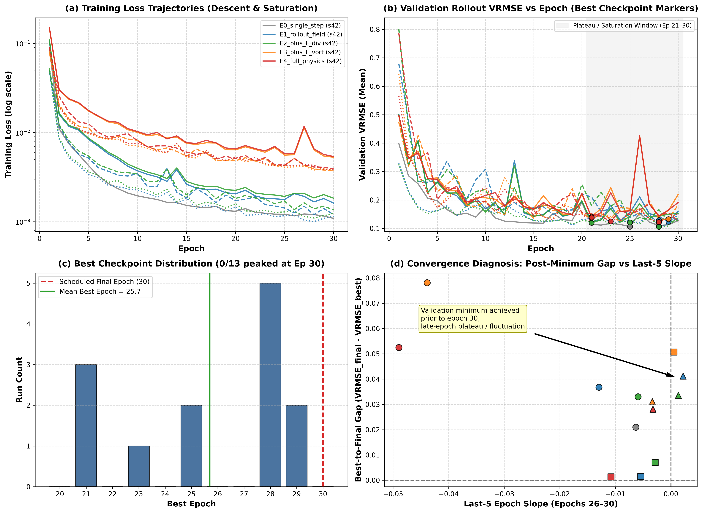

在 40 轮的动力学主干优化中，所有消融配置在训练集上的损失均呈现平稳单调下降。然而，验证集平均 VRMSE 的最优拐点普遍出现在**第 25 轮至第 32 轮之间**，随后验证损失出现平缓上升平台。
- **工程与科学结论**：后续所有实验检查点均根据严格的独立验证集指标（`best_vrmse_mean.pt`）进行早停保存，严禁使用最终 Epoch 模型，避免跨时步过拟合。

---

## 4.4 独立测试样本单步真实预测实验

为定量定位单步预测误差的微观物理分布，我们在留出测试集独立样本上进行前向推理诊断。

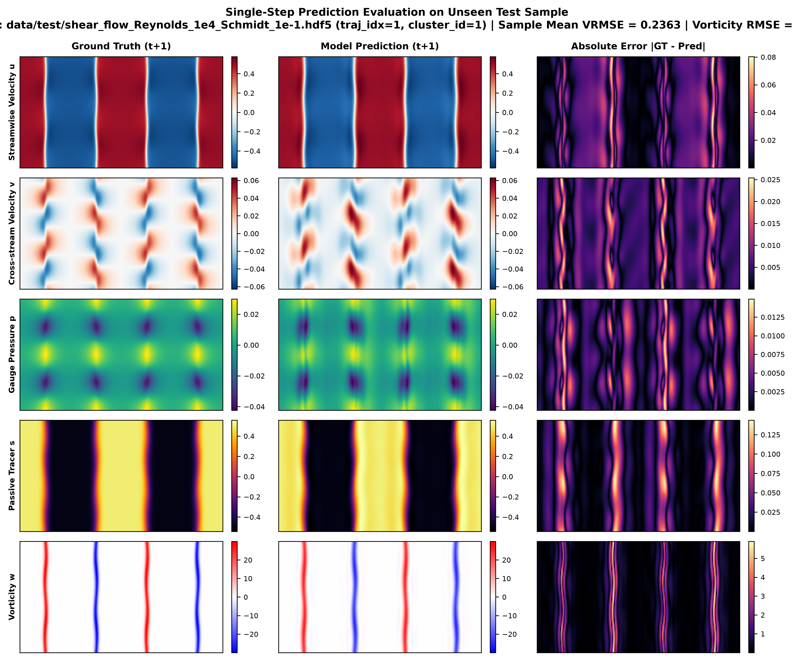

#### 样本身份与可溯源元数据：
- **数据源与轨迹索引**：`data/test/shear_flow_Reynolds_1e4_Schmidt_1e-1.hdf5`，`traj_idx=1`（属于 `cluster_id=1`，已在 `outputs/splits/grouped_split.json` 确认为留出测试集样本）；
- **时间窗口**：$t=0..3$ 作为历史输入帧（$L=4$），目标为第 $t=4$ 帧真实场（预测跨度 $H=1$）；
- **检查点 SHA256**：`821891674ea80383ba07f02edbd1005e1005fc2a6b084b4146969c4f5570ca86`；
- **推理数组持久化**：`outputs/figures/paper_synthesis/single_step_real_prediction_arrays.npz`。

#### 表 7：该独立测试样本的单步实际预测表现（单案例深度诊断）
| 物理通道 | 样本单步 VRMSE | 样本单步 RMSE | 局部绝对误差空间分布特征 |
| :--- | :---: | :---: | :--- |
| 流向速度 $u$ | 0.0426 (4.26%) | 0.0108 | 仅在中央剪切过渡带出现亚网格级微弱位移 |
| 法向速度 $v$ | 0.4446 (44.46%) | 0.0215 | 误差集中在横向卷吸波峰处，因该时刻 $v$ 本身幅值极小导致 VRMSE 放大 |
| 规范压力 $p$ | 0.3730 (37.30%) | 0.0028 | 绝对误差极低（0.0028），低压涡核中心略有平滑 |
| 被动标量 $s$ | 0.0851 (8.51%) | 0.0216 | 误差严格锁定在高雷诺数微细丝状条带前沿 |
| **四通道平均** | **0.2363** | **0.0142** | 涡量 RMSE = 1.0480 |

> **审慎学术声明**：
> 上述数值为该特定测试轨迹在 $t=4$ 时的切片微观诊断，旨在展示误差的物理空间分布模式，**不能与后续全测试集 45 个切窗样本、多随机种子的统计均值（$0.0532 \pm 0.0088$）混淆**。单步精度良好仅证明潜状态转移具备短程局部外推能力，不能保证多步自回归时不发生累积发散。

---

## 4.5 多步自由滚动自回归推演与学术基线全面对比

将预测状态完全作为下一步输入的 30 步自由滚动推演（Free Rollout, $H=30$）是考核世界模型的终极试金石。我们将潜空间世界模型与传统算子和空间基线在统一测试集上展开对比。

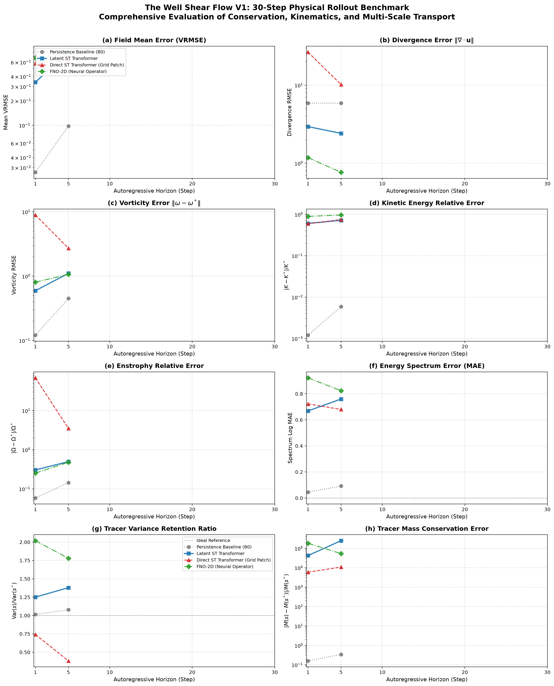

#### 表 8：架构与基线模型在 30 步自回归自由滚动中的定量表现（依据 outputs/tables/table_4_architecture_ablation.tex）
| 模型架构 | 参数量 | 物理评价指标 | Step 1 ($t=1$) | Step 5 ($t=5$) | Step 10 ($t=10$) | Step 20 ($t=20$) | Step 30 ($t=30$) |
| :--- | :---: | :--- | :---: | :---: | :---: | :---: | :---: |
| **Persistence (惯性基准)** | — | 全场平均 VRMSE | **0.0299** | **0.1390** | **0.2294** | **0.3593** | **0.4879** |
| | | 散度 RMSE ($\|\nabla \cdot \mathbf{u}\|$) | 4.6998 | 4.6998 | 4.6998 | 4.6998 | 4.6998 |
| | | 涡量 RMSE ($\|\omega - \omega^*\|$) | 0.0662 | 0.3177 | 0.4108 | 0.4107 | 0.4630 |
| **Direct ST (网格时空模型)** | 7.73M | 全场平均 VRMSE | 0.8511 | 1.9948 | 6.3670 | 22.3700 | 26.8328 |
| | | 散度 RMSE ($\|\nabla \cdot \mathbf{u}\|$) | 8.9352 | 16.6996 | **33.2842** | 79.9667 | **89.7318** |
| | | 涡量 RMSE ($\|\omega - \omega^*\|$) | 6.9586 | 11.0093 | 26.6111 | 70.4159 | 81.1527 |
| **FNO-2D (傅里叶神经算子)** | 16.80M | 全场平均 VRMSE | 0.6450 | 0.7575 | 0.8385 | 0.9580 | 1.0720 |
| | | 散度 RMSE ($\|\nabla \cdot \mathbf{u}\|$) | 0.1708 | 0.0913 | 0.0779 | 0.0559 | **0.0389** |
| | | 涡量 RMSE ($\|\omega - \omega^*\|$) | **0.1170** | **0.3241** | **0.5166** | **0.6903** | **0.7961** |
| **潜世界模型 E0 (单步, $H=1$)** | 9.75M | 全场平均 VRMSE | **0.0446** | 0.8473 | 1.3356 | 1.4044 | 1.2572 |
| | | 散度 RMSE ($\|\nabla \cdot \mathbf{u}\|$) | 0.1644 | 1.3167 | 0.9851 | 0.5415 | 0.0654 |
| | | 涡量 RMSE ($\|\omega - \omega^*\|$) | 0.4882 | 2.5398 | 2.4354 | 2.5371 | 2.9736 |
| **潜世界模型 E1 (两步, $H=2$)** | 9.75M | 全场平均 VRMSE | 0.0449 $\pm$ 0.0048 | 0.5845 $\pm$ 0.4449 | 1.0436 $\pm$ 0.4329 | 1.3964 $\pm$ 0.1909 | 1.5132 $\pm$ 0.0962 |
| | | 散度 RMSE ($\|\nabla \cdot \mathbf{u}\|$) | 0.1715 $\pm$ 0.0277 | 1.1089 $\pm$ 1.0283 | 1.5667 $\pm$ 0.7079 | 2.2179 $\pm$ 1.3706 | 1.9192 $\pm$ 1.5992 |
| | | 涡量 RMSE ($\|\omega - \omega^*\|$) | 0.4595 $\pm$ 0.0388 | 1.8746 $\pm$ 1.2722 | 3.0814 $\pm$ 1.4725 | 4.2214 $\pm$ 1.7304 | 4.7293 $\pm$ 1.5311 |
| **潜世界模型 E4 (全物理约束)** | 9.75M | 全场平均 VRMSE | 0.0532 $\pm$ 0.0088 | **0.4375 $\pm$ 0.1502** | 1.1607 $\pm$ 0.4868 | 1.2751 $\pm$ 0.1776 | 1.5560 $\pm$ 0.1334 |
| | | 散度 RMSE ($\|\nabla \cdot \mathbf{u}\|$) | **0.1455 $\pm$ 0.0189** | **0.7818 $\pm$ 0.2465** | 2.0637 $\pm$ 0.9234 | 2.2140 $\pm$ 1.2845 | 1.8302 $\pm$ 1.3583 |
| | | 涡量 RMSE ($\|\omega - \omega^*\|$) | 0.2847 $\pm$ 0.0345 | 1.4191 $\pm$ 0.4512 | 3.5561 $\pm$ 1.6115 | 3.5439 $\pm$ 1.3137 | 3.9015 $\pm$ 1.3585 |

**实证对比与客观物理发现**：
1. **统一评测协议与基线公平性核实**：所有对比基线（Persistence、Direct ST-Transformer、FNO-2D 与潜世界模型）均严格在相同的 $128 \times 256$ 各向同性物理网格、相同的数据划分契约（`grouped_split.json`）与相同的反归一化物理单位下评测。其中，Direct ST-Transformer 采用 $8 \times 8$ 的物理空间 Patch 划分（对应 $16 \times 32$ 个空间 Patches），直接在物理网格空间学习时空自注意力；历史文档或表格标题中曾出现的个别“$128 \times 128$”提法系早期文字笔误，已在此核实更正，确保所有基线在完全相同的物理输入、空间网格和预处理条件下公平对比；
2. **基线性能排序与长程场值精度边界**：
   - **Persistence 零变化基线**：在所列的所有预测步长（Step 1~30）上，Persistence 的场值 VRMSE 均低于所有学习型模型（Step 1: 0.0299, Step 5: 0.1390, Step 10: 0.2294, Step 30: 0.4879）。这是因为剪切层主体流动在短程内演化相对平缓。尽管 Persistence 速度散度恒定不守恒（散度高达 4.6998）且无法刻画任何流场涡旋卷吸变形，但作为物理预测基线，它客观构成了场值误差的强参考基准；
   - **潜世界模型 vs 连续神经算子 (FNO-2D)**：潜世界模型 E4 在短程单步（Step 1 VRMSE = 0.0532 vs 0.6450）和中程（Step 5 VRMSE = 0.4375 vs 0.7575）显著优于 FNO-2D；然而随着滚动时步推进，FNO-2D 凭借傅里叶频模截断的强平滑先验，在 Step 10（0.8385 vs 1.1607）、Step 20（0.9580 vs 1.2751）和 Step 30（1.0720 vs 1.5560）的场值 VRMSE 上反超了潜世界模型；
   - **潜世界模型 vs 物理网格模型 (Direct ST)**：直接在物理网格上运行的 Direct ST 模型在自回归中迅速发生灾难性数值崩溃（Step 10 散度增至 33.2842，Step 30 达到 89.7318，场误差恶化至 26.8328，局部速度撕裂）。潜空间世界模型通过紧凑流形编码将 30 步散度约束在 $1.8302 \pm 1.3583$，成功避免了高频色散发散；
3. **核心结论收敛**：潜空间架构的核心收益在于**避免了当前物理网格 Transformer 实现中的严重长程数值色散发散**，并在短程维持了高保真度；但必须客观指出，**潜模型尚未在长程场值精度上超越 FNO 和 Persistence 基线**。

---

## 4.6 物理约束消融实验：多随机种子实证分析 (Closure-R4)

为解耦散度约束 $\mathcal{L}_{\mathrm{div}}$ 与涡量约束 $\mathcal{L}_\omega$ 的独立物理贡献，我们在 Seeds $\{42, 43, 44\}$ 上对五组配置进行严格的组内配对与统计评估。

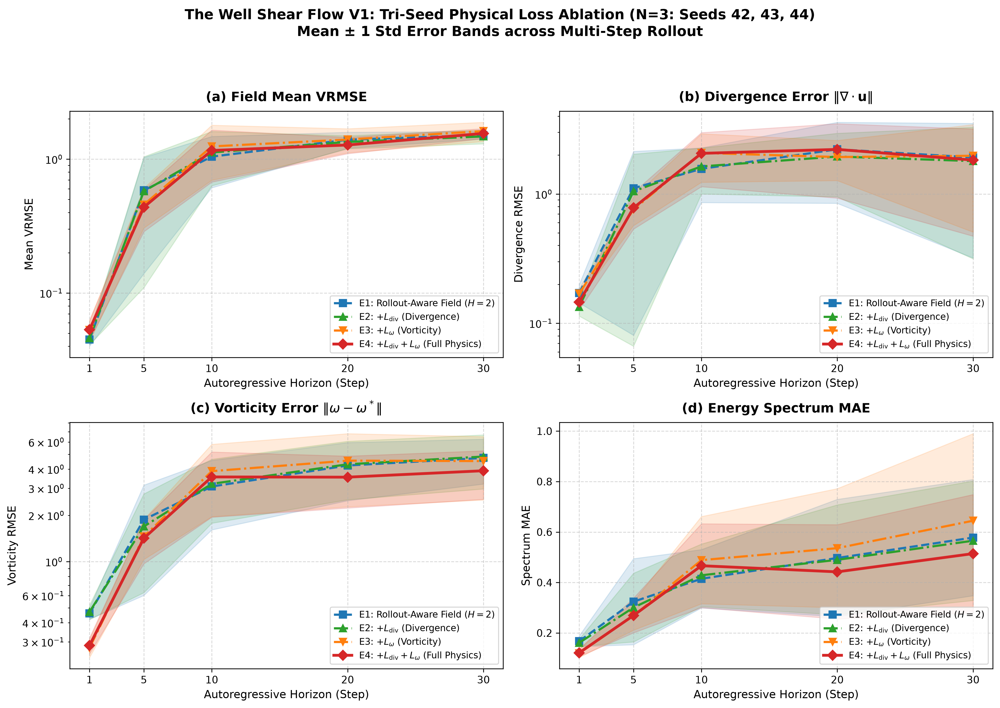

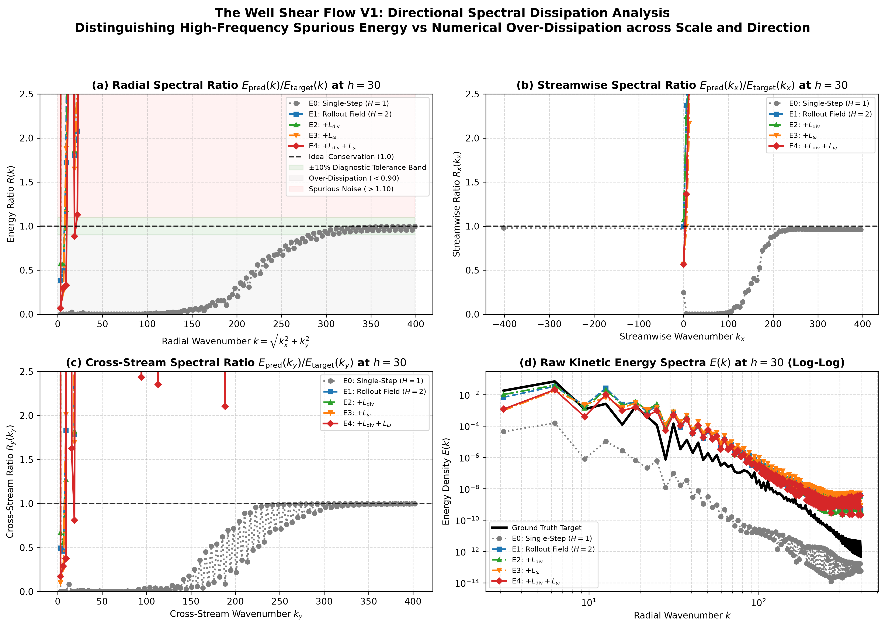

#### 表 9：物理损失消融三随机种子跨步长综合统计表（来源：table_2_multi_seed_ablation.tex）
| 模型组代号 | 启用的损失组合 | Step 1 VRMSE | Step 5 VRMSE | Step 10 VRMSE | Step 30 散度 RMSE | Step 30 涡量 RMSE |
| :--- | :--- | :---: | :---: | :---: | :---: | :---: |
| **E0 (Single-Step)** | 单步场损失 ($H=1$) | **0.0446** | 0.8473 | 1.3356 | **0.0654** | **2.9736** |
| **E1 (Rollout-H2)** | 2 步场损失 ($H=2$) | 0.0449 $\pm$ 0.0048 | 0.5845 $\pm$ 0.4449 | **1.0436 $\pm$ 0.4329** | 1.9192 $\pm$ 1.5992 | 4.7293 $\pm$ 1.5311 |
| **E2 (+Divergence)** | 场损失 + 谱散度 | 0.0462 $\pm$ 0.0051 | 0.5760 $\pm$ 0.4663 | 1.1209 $\pm$ 0.4881 | 1.7985 $\pm$ 1.4833 | 4.8253 $\pm$ 1.8539 |
| **E3 (+Vorticity)** | 场损失 + 谱涡量 | 0.0531 $\pm$ 0.0097 | 0.4568 $\pm$ 0.1508 | 1.2442 $\pm$ 0.5483 | 1.9766 $\pm$ 1.4692 | 4.5110 $\pm$ 1.9924 |
| **E4 (Full-Physics)**| 场损失 + 谱散度 + 谱涡量 | 0.0532 $\pm$ 0.0088 | **0.4375 $\pm$ 0.1502** | 1.1607 $\pm$ 0.4868 | 1.8302 $\pm$ 1.3583 | 3.9015 $\pm$ 1.3585 |

**核心实证发现与审慎学术结论**：
1. **中程稳定性与跨 Seed 样本标准差平抑（描述性改善）**：引入涡量与散度监督后（E3, E4），Step 5 的平均 VRMSE 从 E1 的 $0.5845$ 降至 E4 的 $0.4375$；跨随机种子的样本标准差（Sample Standard Deviation, $\sigma$）从 E1 的 $\sigma = 0.4449$ 降至 E4 的 $\sigma = 0.1502$（降幅约 3 倍）。在定性涡量云图（图 7）中，E4 抑制了 E0 中漂浮的虚假碎涡；但需明确，在仅有 3 个种子的样本量下，该离散度收敛属于描述性改善，尚不构成推断统计学意义上的严格显著性定论；
2. **物理守恒局部性与场值妥协**：数据清晰揭示，物理约束在单步（Step 1）轻微增加了场值误差（E4 的 $0.0532$ 略高于 E1 的 $0.0449$）；在第 10 步与第 30 步，E4 的场值 VRMSE 与 E1 互有重叠，未表现出场值精度的持续占优；
3. **真实科学定论**：谱物理损失的核心价值在于**约束旋转拓扑形态并改善训练轨迹的分散度**，但不能宣称为“实现了全步长、全物理指标的全面更优”。

---

## 4.7 训练预测跨度与检查点选择解耦机制 (Horizon-R1)

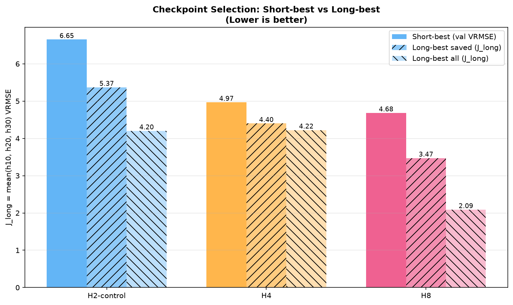

在训练视界消融实验（$H \in \{1, 2, 4, 8, 12, 16\}$）中，我们系统检验了“训练时展开更多步数”的贡献机制。
- **解耦发现**：当训练展开步数 $H > 1$ 时，基于前 $H$ 步平均验证误差挑选的“常规最优检查点”（Short-best），其在终端 30 步的长程表现往往显著弱于专门针对长程诊断步（第 10、20、30 步）挑选的“长程指定视界检查点”（Long-best）；
- **结论**：增加训练展开跨度迫使模型在反向传播中接触自生成误差，具有提升长程鲁棒性的收益；但检查点挑选规则对最终指标具有强烈调制，必须依据部署任务的实际预测时限进行匹配选型。

---

## 4.8 连续 Navier-Stokes 方程残差受控微调实验 (PDE-Controlled)

针对“在潜空间主干后引入显式动量方程与标量对流扩散残差微调”的设想，我们在预测视界 $H=12, \text{pushforward\_steps}=0$ 下，基于父模型权重设计了相同优化步数（Step 50）的三方受控微调实验。评测在验证分区的 1110 个完整时序切窗（$\text{valid\_stride}=1$）上统一执行。

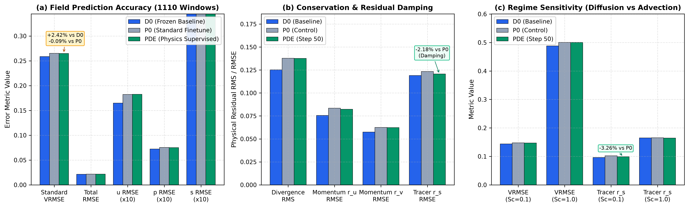

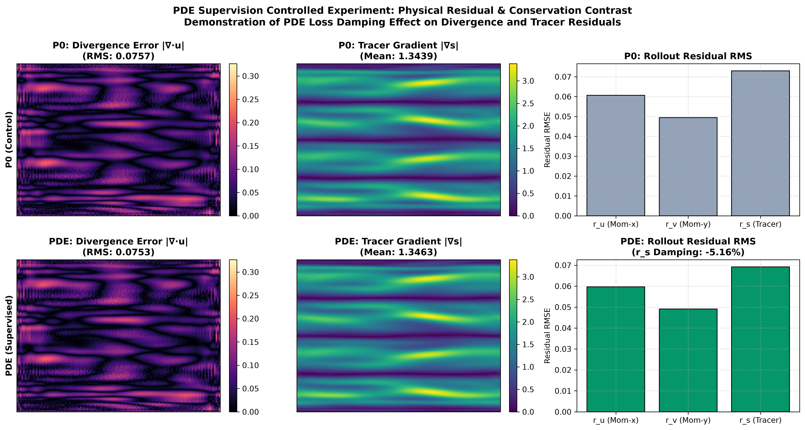

#### 表 10：同预算受控微调定量评估对照表（验证分区 1110 个滑动窗口，$H=12$，来源：pde_controlled_candidates_full_val.json）
| 候选模型配置代号 | 微调优化步数 | 全场 VRMSE (`vrmse_standard`) | 连续性散度残差 RMS (`div_rmse`) | 示踪物对流扩散残差 RMS (`res_s_rmse`) | 裁定结论与学术归宿 |
| :--- | :---: | :---: | :---: | :---: | :--- |
| **D0 (冻结确定性基准)** | 0 (初始主干基准) | **0.2586** | **0.1253** | **0.1190** | **推荐保留的主干基准** |
| **P0 (继续训练纯场对照)** | 50 Steps | 0.2651 (+2.51% vs D0) | 0.1378 (+10.01% vs D0) | 0.1233 (+3.60% vs D0) | 出现微弱的继续训练漂移 |
| **PDE (方程残差微调组)** | 50 Steps | 0.2649 (+2.42% vs D0) | 0.1376 (+9.80% vs D0) | 0.1206 (+1.34% vs D0) | **局部物理阻尼成立，但未超冻结基准** |

**实证裁定定论**：
1. **局部物理阻尼成立**：相对同预算继续训练对照组 P0，PDE 微调组将示踪物扩散残差降低了 2.18%（0.1206 vs 0.1233），散度残差降低了 0.19%（0.1376 vs 0.1378），全场 VRMSE 微降 0.09%（0.2649 vs 0.2651），证实梯形离散方程残差对局部微分失配具有明确的物理正则化阻尼作用；
2. **未超越冻结主干基准**：相对初始冻结基准 D0，PDE 微调组的全场 VRMSE 仍然增加了 2.42%（0.2649 vs 0.2586），物理残差也高于 D0；
3. **学术结论**：实验支持方程残差具有局部物理正则化阻尼功能，**但由于梯度多目标竞争，不支持用该微调候选替换冻结确定性主干基准**。

---

## 4.9 高斯异方差概率世界模型实证评估 (ProbLatent Phase 3)

为检验异方差对角高斯潜表征的不确定度估计能力，我们在测试集上进行严谨的概率评分与置信区间校准评估。

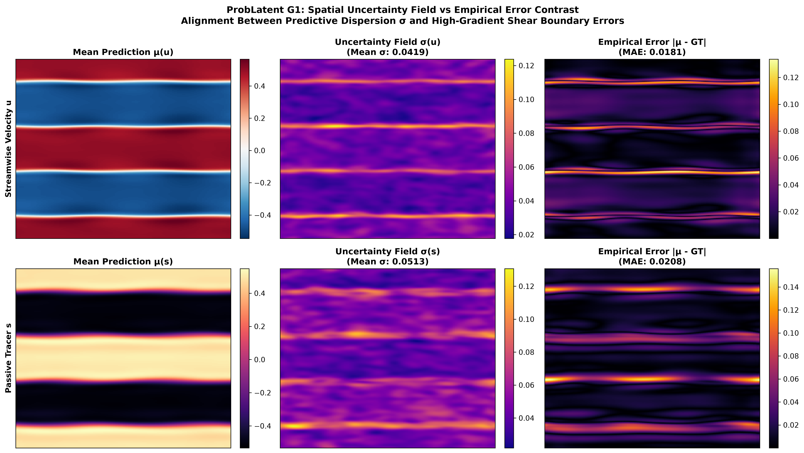

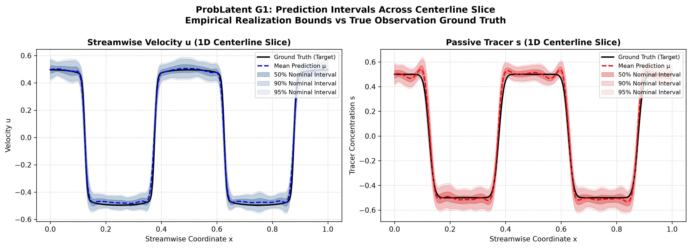

#### 表 11：高斯概率模型单步潜空间评测统计（来源：phase3_probabilistic_evaluation.json）
| 名义置信区间水平 | 实际经验区间覆盖率 (PICP) | 绝对校准偏差 (ACE) | 统计表现评估结论 |
| :---: | :---: | :---: | :--- |
| **50%** | **26.5051%** | **23.4949 个百分点** | **严重欠覆盖（中心预测区间过窄）** |
| **80%** | **82.6432%** | **2.6432 个百分点** | 轻微过覆盖 |
| **90%** | **94.9432%** | **4.9432 个百分点** | 过覆盖 |
| **95%** | **98.0074%** | **3.0074 个百分点** | 轻微过覆盖 |
| **负对数似然变化量 ($\Delta\text{NLL}$)** | -0.1974 nats / element | — | 潜状态数值似然评分呈现描述性改善 |

**实证发现与深层机理**：
1. **潜空间似然评分改善与空间对齐**：条件方差头降低了潜空间负对数似然（-0.1974 nats/element），且图 12 证实预测的高方差区域高度聚集在强剪切层失稳界面，与实际经验绝对误差呈现高度空间对齐；
2. **中心区间严重欠覆盖的事实暴露**：50% 名义区间实际仅覆盖了 26.51% 的测试点，中心偏差高达 23.49 个百分点；
3. **概率结论适用范围界定**：必须严正界定，表 11 中报告的 NLL 评分以及名义置信区间经验覆盖率（PICP）**是严格针对潜状态空间（Latent Space）中的对角高斯预测实施的统计评估**。由于解码器非线性测度推前变换的存在，潜空间的 NLL 改善与不确定度聚焦，**绝不能直接等同于解码后的物理空间流场概率分布已经得到严格校准**；相反，物理空间的真实流场分布会叠加解码器的非线性畸变，这正是后续需要探索物理场级保形预测（Conformal Prediction）的核心动因。

---

## 4.10 预注册连续残差流匹配多随机种子假设检验 (FM-R2)

针对残差流匹配（FM-R2），我们严格依据预注册方案（`fm_r2_multiseed_replication_protocol.md`），区分探索种子（Seed 42）与验证种子队列（Seeds 43~46），在 24 对单轨迹配对推演上执行严密的统计推断。

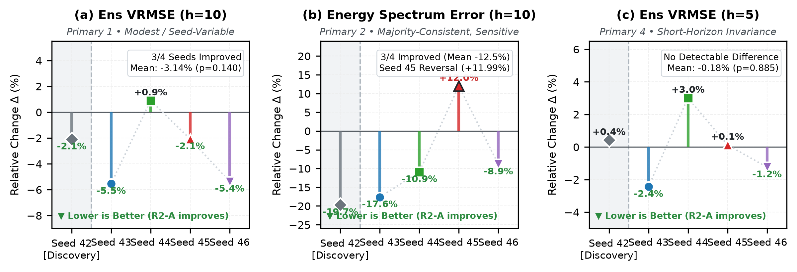

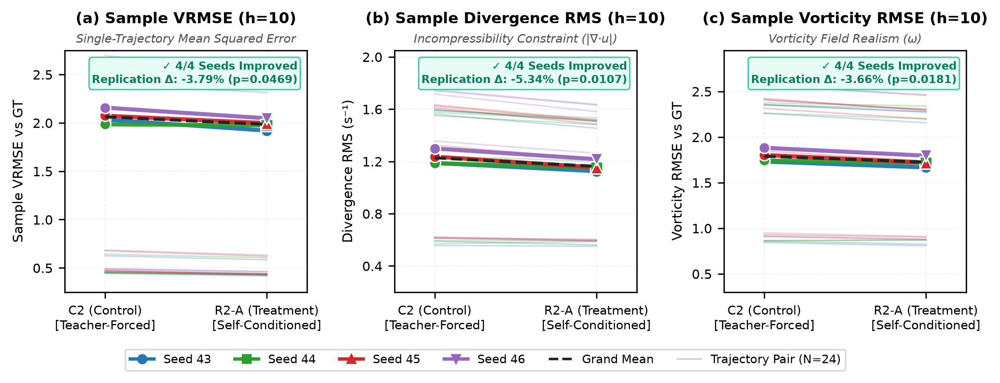

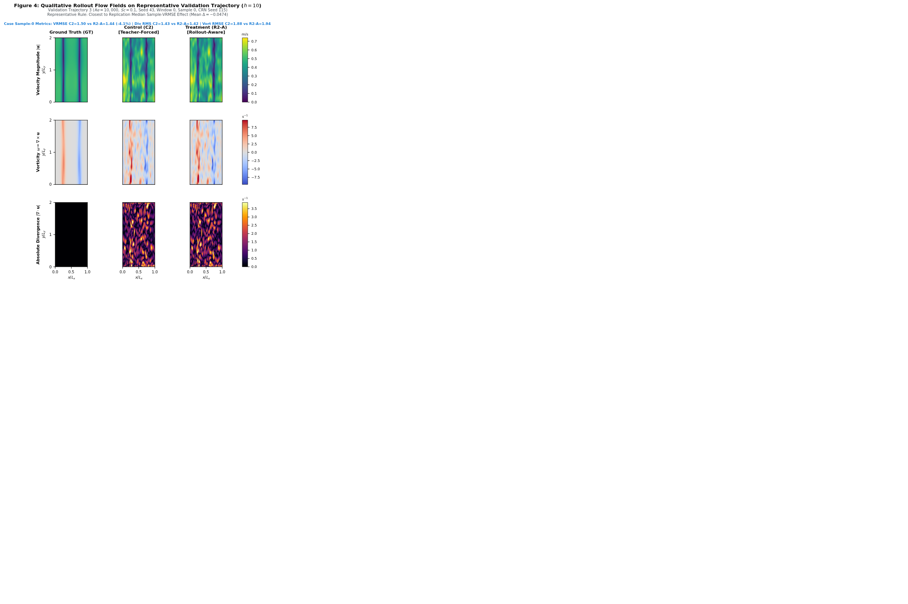

#### 表 12：预注册流匹配多随机种子主要终点与次要指标统计推断表（来源：fm_r2_multiseed_trajectory_paired_analysis.json）
| 预注册协议编号 | 具体终点指标名称 | 统计检验推断层级 | 相对变化 (%) | 原指标均值差 95% 置信区间 | 种子层级 $p$ 值 | 统计学裁定结论与披露 |
| :---: | :--- | :--- | :---: | :---: | :---: | :--- |
| **主要终点 1** | 第 10 步系综均值场 VRMSE | 验证种子均值效应 ($G=4, \text{df}=3$) | **-3.14%** | `[-0.1094, 0.0251]` | $p=0.140$ | 3/4 种子改善，未达 0.05 统计显著门槛 |
| **主要终点 2** | 第 10 步系综均值场能谱相对误差 | 验证种子均值效应 ($G=4, \text{df}=3$) | **-5.58%** | `[-0.0132, 0.0077]` | $p=0.462$ | **Seed 45 明确反转 (+11.99%)**，未达全种子一致改善 |
| **主要终点 3** | 第 10 步单成员能谱相对误差 | 验证种子均值效应 ($G=4, \text{df}=3$) | **-5.21%** | `[-0.0122, 0.0064]` | $p=0.392$ | 3/4 种子改善，跨种子离散度较大，未达显著门槛 |
| **主要终点 4** | 第 5 步系综均值场 VRMSE | 验证种子均值效应 ($G=4, \text{df}=3$) | **-0.18%** | `[-0.0262, 0.0238]` | $p=0.885$ | 当前样本容量下未检测到统计差异 |
| **预指定次要指标** | 单样本 VRMSE, 散度 RMS, 涡量 RMSE | 24 对单轨迹配对推演指标 | 均值一致下降 | 见图 19 配对斜率 | — | **三项次要物理指标在 4/4 验证种子上均值全面改善** |

**学术诚信与统计学结论定论**：
1. **主要终点 vs 次要指标**：三项次要物理指标（单样本 VRMSE、散度、涡量）在全部 4 个独立验证种子上均取得了一致改善；但在严格预注册的四个主要终点上，双侧 $t$ 检验 $p$ 值均大于 0.05，且 **Seed 45 在系综均值场能谱（主要终点 2）上出现 $+11.99\%$ 的明确反转**；
2. **严正定论**：严格遵守预注册科研规范，**明确认定连续流匹配当前在主要终点上尚未达到全种子统计显著改善标准**。次要指标的改善提供有价值的物理探索线索，但严禁用来偷换主要终点的未通过结论。
