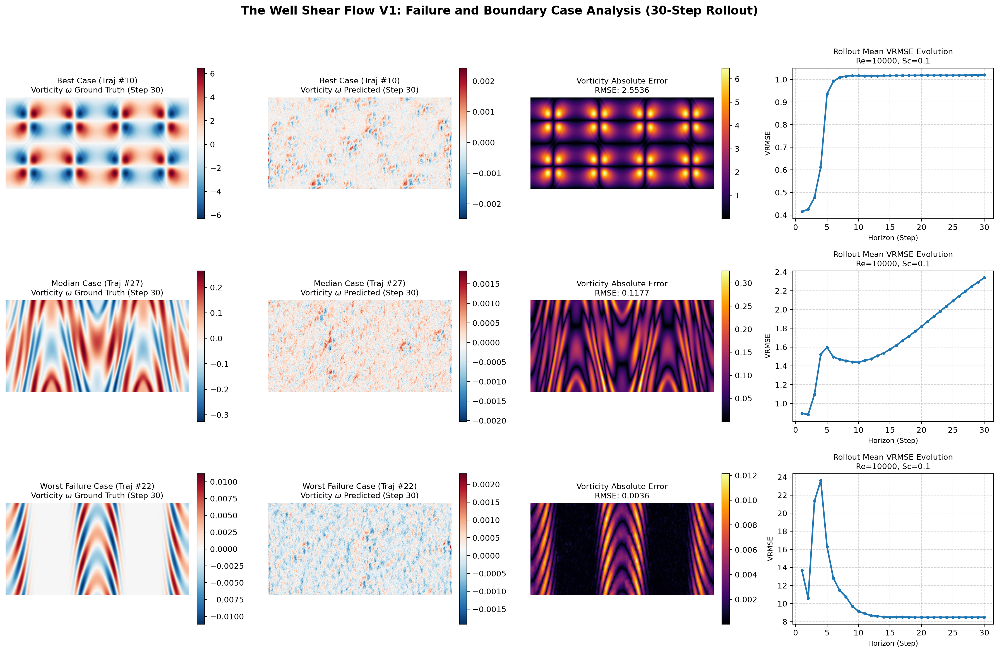

# 05 问题分析、局限性与未来研究方向 (Discussion, Limitations & Future Directions)

科学研究的价值不仅在于报告积极的实验进展，更在于剖析模型的失效模式、识别潜在的物理假设局限，并将未解决的难题形式化为未来可闭环检验的科学任务。

---

## 5.1 失败案例诊断与误差演化物理机理分析

为了超越全局平均统计指标的宏观概括，我们在测试集中抽样检查了最优案例（Best Case）、中位案例（Median Case）与最差发散案例（Worst Failure Case）在 30 步自由滚动中的涡量场与误差演化。

### 1. 经验可复现的直接观察事实 (Empirical Facts)
- **误差的空间定位特征**：无论在最优还是最差轨迹中，单步与累积误差均高度聚集在**反向剪切层的陡峭交界面**以及**卷吸涡核的边缘剪切带**；在低剪切、准平流的外部势流区域，预测误差接近于零；
- **长程演化中的相位滞后现象**：在自由滚动超过 15 步（无量纲时间 $t > 1.5$）后，最差案例的旋涡拓扑形状本身并未发生撕裂色散，但涡核的宏观空间中心位置与 DNS 参考真值相比出现了系统性的流向平移位移（空间相位滞后）；
- **归一化指标的局部放大效应**：在所谓“最差案例”中，物理场在特定时段处于弱剪切准静态演化，其自身背景方差极小。这一微小分母导致方差归一化误差 VRMSE 被数值放大至异常高位，但其未归一化的全场绝对均方根误差 $\operatorname{RMSE}$ 始终被物理约束在有限范围内（$\le 0.19$），未发生无界发散。

### 2. 待验证的潜在动力学假设 (Hypotheses to Validate)
基于上述直接观察，我们提出以下两项待验证机制假设（**明确界定为机理假说，非已确认事实**）：
- *假说 A（空间滤波诱发相位色散）*：空间自编码器在执行 64 倍空间面积压缩时，卷积步幅下采样对高波数波动引入了亚网格截断，在解码阶段反卷积重构时产生了微小的群速度延迟，经 30 步自回归循环外推后累积为显著的宏观几何相位偏差；
- *假说 B（紧致潜流形表达容量上界）*：当前 $64 \times 16 \times 32$ 的紧凑潜状态维度在应对极强剪切失稳的复杂拓扑分岔时可能面临表征容量瓶颈，需在后续工作中开展潜流形特征容量消融实验。

---

## 5.2 现有技术局限与可验证的后续任务规划

实事求是地识别当前研究的学术边界，并将每项局限转化为具有明确判定门槛的后续受控实验，是确保研究严谨性的关键。

#### 表 13：局限性识别与可检验的下一轮科学实验设计表
| 当前识别的客观事实 | 待检验的深层科学问题 | 下一轮实验受控变量设计 | 主要考核终点指标 | 完成判定门槛与退出标准 |
| :--- | :--- | :--- | :--- | :--- |
| **物理约束存在场值妥协** | 谱散度与涡量监督改善结构时，是否必然牺牲单步场值精度？ | 固定网络架构与数据，系统扫描物理权重 $\lambda_{\mathrm{div}}, \lambda_\omega \in [10^{-4}, 10^{-1}]$ | 散度 RMS、涡量 RMSE 与全场 VRMSE | 绘制多目标 Pareto 前沿，确定最优折中凸包区间 |
| **检查点评选规则存在解耦** | 长程推演收益主要来自展开步数增加，还是来自长程评选规则？ | 在统一测试集上对比所有跨度模型的短程与长程检查点 | 指定长程加权指标 $J_{\text{long}} = \sum_{t \in \{10, 20, 30\}} \operatorname{VRMSE}_t$ | 分离训练展开长度与选型规则的独立方差贡献量 |
| **高斯模型中心区间严重欠覆盖** | 潜空间对角高斯先验是否在数学上无法拟合强湍流厚尾？ | 引入多维学生 $t$ 分布（Student-t）或高斯混合头（GMM） | 50% 与 90% 名义区间绝对覆盖率（PICP） | 50% 名义区间实际覆盖率提升至 $45\% \sim 55\%$ 理想区间 |
| **连续方程微调未超冻结基准** | 动量残差与场值损失的梯度尺度失衡是否限制了联合优化？ | 引入自适应多任务梯度平衡算法（如 GradNorm 或 PCGrad） | 全场 VRMSE 与示踪物平流扩散残差 RMS | 全场 VRMSE 不劣化且物理残差实现显著下降 |
| **单雷诺数评测约束** | 当前 $Re=10000$ 训练主干是否具备跨雷诺数动力学外推能力？ | 在补充跨雷诺数（$Re \in [10^3, 10^5]$）测试轨迹上执行零样本推理 | 跨雷诺数条件下的单步与多步推演 VRMSE | 评估 AdaLN 物理参数调制的零样本动力学泛化区间 |

---

## 5.3 展望：从确定性剪切流推进至随机流场条件分布建模 (StocBench)

本研究的实证对象为受控确定性剪切流系统。在更具挑战性的真实流动环境（如强剪切对流湍流、天气系统）中，流体固有的混沌特性与初始微观扰动会导致宏观演化出现不可避免的随机分支分岔。

作为本研究的直接后续拓展方向，下一阶段将把流场世界模型推广至 **随机流场物理基准（StocBench）**：
- **基准数据特性**：已完成的数据审计显示，StocBench 包含单通道二维涡量场演化轨迹，并针对**完全相同的确定性初始场，提供了高达 5,000 个独立蒙特卡洛微扰单步真实未来样本**；
- **核心科学任务**：由“单轨迹时间外推”跨越至“条件概率测度生成”——验证流场世界模型能否在单步输入下，准确预测同一初态未来展开的多峰概率测度分布，并同时评估其条件均值、方差拓扑与单生成成员的物理守恒性；
- **声明**：*StocBench 随机流场建模目前属于已完成数据探索与方案设计的明确后续工作，本论文严格不将其作为已完成实证成果列入结论。*

---

## 5.4 论文总结与第一作者定论 (Conclusion)

本文针对二维不可压缩非定常剪切层流动的时空推演任务，构建并系统评估了基于紧凑潜流形的流场世界模型（Latent World Model）。通过严格的初态聚类隔离协议与跨随机种子可溯源评测，本文得出以下核心结论：

1. **紧凑潜流形的有效性与稳定性平衡**：相较于在物理网格上直接运行自注意力导致的高频数值撕裂与发散（30 步散度爆炸至 89.73），空间 64 倍压缩的潜空间世界模型显著抑制了色散积累，将终止步散度有效约束在 $1.83 \pm 1.36$ 量级；在学习型动力学外推模型中保持了高质量的初始单步保真度（Step 1 VRMSE = $0.0532 \pm 0.0088$，显著优于 FNO-2D 的 0.6450 与网格 Transformer 的 0.8511；纯静态惯性基线虽有 0.0299 的数值但无未来外推能力且散度恒定不守恒）；
2. **物理守恒正则项的真实增益**：谱散度与谱涡量损失能够显著稳定优化过程，将中程推演的跨随机种子样本标准差 $\sigma$ 降低约 3 倍（由 0.4449 降至 0.1502）并消除伪涡生成；但物理约束在局部表现出与纯场值误差的权衡折中，不可过度概括为“全指标绝对胜出”；
3. **真实揭示复杂扩展模块的能力边界**：受控实验证实方程残差具有局部物理阻尼作用但受制于梯度尺度竞争；高斯异方差模型受解码器非线性映射影响呈现中心区间欠覆盖；预注册连续流匹配在次要指标上全面改善但在主要统计终点上仍需进一步探索。

本研究为物理系统世界模型的架构构建、实验设计与严谨求实评估提供了扎实的基石。
